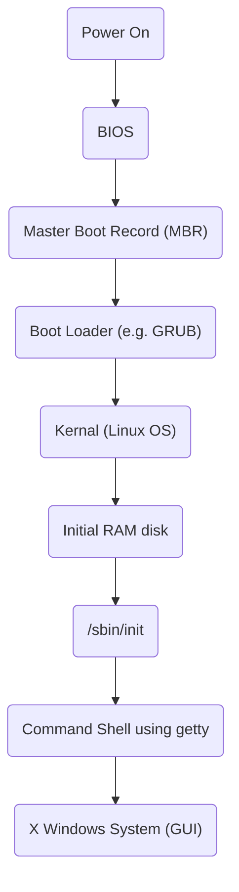

# Cpp Interview Questions

## Embedded Software Development Engineer

### Difference between Serial Communication protocols like I2C, SPI and UART

| Feature       | UART (Universal Asynchronous Receiver Transmitter)                 | I2C (Inter-Integrated Circuit)                                | SPI (Serial Peripheral Interface)                      |
| ------------- | --------------------------------------------------------------------- | ---------------------------------------------------------------- | --------------------------------------------------------- |
| Wire          | 2 - TX(transmit), RX(receive)                                         | 2 - SDA(data), SCL(clock)                                        | 4+ - MOSI, MOSO, SCLK, SS (chip select), one CS per slave |
| Speed         | Low                                                                   | Medium                                                           | High                                                      |
| Communication | Asynchronous (no shared clock); devices must agree on baud rate       | Synchronous, multi-master/multi-slave                            | Synchronous, full-duplex                                  |
| Topology      | Point-to-Point                                                        | Multi-Slave                                                      | Multi-Slave with Chip Select(CS)                          |
| Use Case      | Simple point-to-point communication (e.g. debug console, GPS modules) | Connecting multiple low-speed peripherals (e.g. sensors, EEPROM) | High-speed communication with sensors, flash, displays    |

Answer:

“In my experience, I use UART for debug and simple comms, I2C when I need multiple low-speed sensors, and SPI when I care about speed or use peripherals like displays or flash chips.”

### What happens when you boot?

Reference: [Link](https://leetcode.com/discuss/post/124638/what-happens-in-the-background-from-the-f4k7h/), [Link](https://opensource.com/article/17/2/linux-boot-and-startup)

1. BIOS

The Basic Input/Output System (BIOS) initializes the hardware, including the screen and keyboard, and tests the main memory. This process is also called POST (Power On Self Test).

The BIOS software is stored on a ROM chip on the motherboard. After this, the remainder of the boot process is completely controlled by the operating system.

2. Master Boot Records (MBR) and Boot Loader

Once the POST is completed, the system control passes from the BIOS to the boot loader. The boot loader is usually stored on one of the hard disks in the system, either in the boot sector (for traditional BIOS/MBR systems). Up to this stage, the machine does not access any mass storage media. Thereafter, information on the date, time, and the most important peripherals are loaded from the CMOS values (after a technology used for the battery-powered memory store - which allows the system to keep track of the date and time even when it is powered off).

A number of boot loaders exist for Linux; the most common ones are GRUB (for GRand Unified Boot loader) and ISOLINUX (for booting from removable media). Most Linux boot loaders can present a user interface for choosing alternative options for booting Linux, and even other operating systems that might be installed. When booting Linux, the boot loader is responsible for loading the kernel image and the initial RAM disk (which contains some critical files and device drivers needed to start the system) into memory.

3. Boot Loader in Action

The boot loader has two distinct stages:

First Stage:

For systems using the BIOS/MBR method, the boot loader resides at the first sector of the hard disk also known as the Master Boot Record(MBR). The size of the MBR is just 512 bytes. In this stage, the boot loader examines the partition table and finds a bootable partition. Once it finds a bootable partition, it then searches for the second stage bootloader e.g, GRUB, and loads it into RAM (Random Access Memory).

Second Stage:

The second stage boot loader resides under /boot. A splash screen is displayed which allows us to choose which Operating System (OS) to boot. After choosing the OS, the boot loader loads the kernel of the selected operating system into RAM and passes control to it.
The boot loader loads the selected kernel image (in the case of Linux) and passes control to it. Kernels are almost always compressed, so it's first job is to uncompress itself. After this, it will check and analyze the system hardware and initialize any hardware device drivers built into the kernel.

4. The Linux Kernel

The boot loader loads both the kernel and an initial RAM–based filesystem (initramfs) into memory so it can be used directly by the kernel.
When the kernel is loaded in RAM, it immediately initializes and configures the computer’s memory and also configures all the hardware attached to the system. This includes all processors, I/O subsystems, storage devices, etc. The kernel also loads some necessary user space applications.

5. The Initial RAM Disk

The initramfs filesystem image contains programs and binary files that perform all actions needed to mount the proper root filesystem, like providing kernel functionality for the needed file system and device drivers for mass storage controllers with a facility called udev (for User Device) which is responsible for figuring out which devices are present, locating the drivers they need to operate properly, and loading them. After the root filesystem has been found, it is checked for errors and mounted.

The mount program instructs the operating system that a file system is ready for use, and associates it with a particular point in the overall hierarchy of the filesystem (the mount point). If this is successful, the initramfs is cleared from RAM and the init program on the root filesystem (/sbin/init) is executed.

init handles the mounting and pivoting over to the final real root filesystem. If special hardware drivers are needed before the mass storage can be accessed, they must be in the initramfs image.

6. /sbin/init and Services

Once the kernel has set up all its hardware and mounted the root filesystem, the kernel runs the /sbin/init program. This then becomes the initial process, which then starts other processes to get the system running. Most other processes on the system trace their origin ultimately to init; the exceptions are kernel processes, started by the kernel directly for managing internal operating system details.

Traditionally, this process startup was done using conventions that date back to System V UNIX, with the system passing through a sequence of runlevels containing collections of scripts that start and stop services. Each runlevel supports a different mode of running the system. Within each runlevel, individual services can be set to run, or to be shut down if running. Newer distributions are moving away from the System V standard, but usually support the System V conventions for compatibility purposes.

Besides starting the system, init is responsible for keeping the system running and for shutting it down cleanly. It acts as the "manager of last resort" for all non-kernel processes, cleaning up after them when necessary, and restarts user login services as needed when users log in and out.

7. Text Mode Login

Near the end of the boot process, init starts a number of text-mode login prompts (done by a program called getty). These enable you to type your username, followed by your password, and to eventually get a command shell.

Usually, the default command shell is bash (the GNU Bourne Again Shell), but there are a number of other advanced command shells available. The shell prints a text prompt, indicating it is ready to accept commands; after the user types the command and presses Enter, the command is executed, and another prompt is displayed after the command is done.

8. X Window System (Optional)