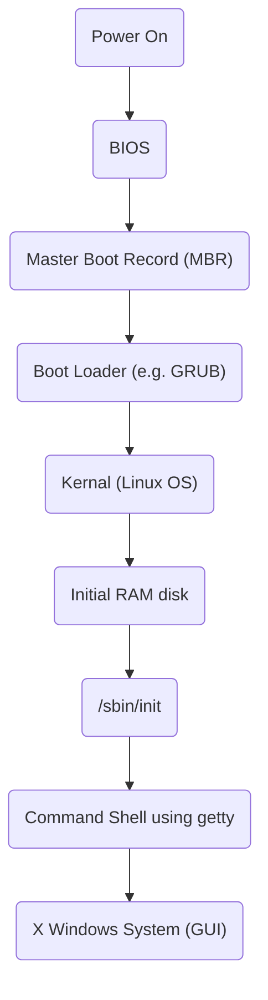

# Cpp Interview Questions

## Embedded Software Development Engineer

### Difference between Serial Communication protocols like I2C, SPI and UART


| Feature       | UART<br>(Universal Asynchronous Receiver Transmitter)                 | I2C<br>(Inter-Integrated Circuit)                                | SPI<br>(Serial Peripheral Interface)                      |
| ------------- | --------------------------------------------------------------------- | ---------------------------------------------------------------- | --------------------------------------------------------- |
| Wire          | 2 - TX(transmit), RX(receive)                                         | 2 - SDA(data), SCL(clock)                                        | 4+ - MOSI, MOSO, SCLK, SS (chip select), one CS per slave |
| Speed         | Low                                                                   | Medium                                                           | High                                                      |
| Communication | Asynchronous (no shared clock); devices must agree on baud rate       | Synchronous, multi-master/multi-slave                            | Synchronous, full-duplex                                  |
| Topology      | Point-to-Point                                                        | Multi-Slave                                                      | Multi-Slave with Chip Select(CS)                          |
| Use Case      | Simple point-to-point communication (e.g. debug console, GPS modules) | Connecting multiple low-speed peripherals (e.g. sensors, EEPROM) | High-speed communication with sensors, flash, displays    |

Answer:

“In my experience, I use UART for debug and simple comms, I2C when I need multiple low-speed sensors, and SPI when I care about speed or use peripherals like displays or flash chips.”

### UART (Universal Asynchronous Receiver-Transmitter)

UART, or Universal Asynchronous Receiver-Transmitter, is a hardware communication protocol commonly used in embedded systems for serial communication. It allows for the exchange of data between devices, such as microcontrollers, sensors, and computers, using a simple two-wire interface: one for transmitting data (TX) and one for receiving data (RX).

#### Key Features of UART:

**Asynchronous Communication:** UART does not require a clock signal to synchronize the transmitter and receiver. Instead, it uses start and stop bits to frame the data, which allows for flexible timing.

**Data Framing:** Each data packet typically consists of:
- 1 Start Bit: Indicates the beginning of a transmission.
- Data Bits: Usually 5 to 9 bits of actual data.
- Optional Parity Bit: Used for error checking (even, odd, or none).
- 1 or 2 Stop Bits: Indicate the end of the transmission.

**Baud Rate:** The speed of communication is defined by the baud rate, which indicates how many bits per second are transmitted. Both the transmitter and receiver must be set to the same baud rate for successful communication.

**Full Duplex:** UART can send and receive data simultaneously, allowing for full-duplex communication.

**Simplicity:** The UART protocol is simple to implement in hardware and software, making it a popular choice for many embedded applications.

#### Applications of UART:

**Microcontroller Communication:** UART is often used to interface microcontrollers with peripherals like GPS modules, Bluetooth devices, and GSM modules.

**Debugging:** Developers frequently use UART for debugging purposes, allowing them to send log messages from an embedded system to a terminal on a computer.

**Data Transfer:** It is commonly used for low-speed data transfer between devices.

#### Example of UART Communication:

In a typical scenario, a microcontroller might send a command to a GPS module using UART. The microcontroller configures the UART settings (baud rate, data bits, etc.), sends a command string, and waits for a response, which the GPS module sends back over the same UART interface.

Overall, UART is a foundational technology in embedded systems, providing a reliable way to facilitate communication between various components.

### I2C (Inter-Integrated Circuit)

#### Working of I2C Communication Protocol
It uses only 2 bi-directional open-drain lines for data communication called SDA and SCL. Both these lines are pulled high.

+ **Serial Data (SDA):** Transfer of data takes place through this pin.
+ **Serial Clock (SCL) :** It carries the clock signal.

I2C operates in 2 modes
+ Master mode
+ Slave mode

Each data bit transferred on SDA line is synchronized by a high to the low pulse of each clock on the SCL line.

According to I2C protocols, the data line can not change when the clock line is high, it can change only when the clock line is low. The 2 lines are open drain, hence a pull-up resistor is required so that the lines are high since the devices on the I2C bus are active low. The data is transmitted in the form of packets which comprises 9 bits. The sequence of these bits are
1. Start Condition: 1 bit
2. Slave Address: 8 bit
3. Acknowledge: 1 bit

#### Steps of I2C Data Transmission

Here are the steps of I2C (Inter-Integrated Circuit) data transmission

1. **Start Condition:** The master device sends a start condition by pulling the SDA line low while the SCL line is high. This signals that a transmission is about to begin.
2. **Addressing the Slave:** The master sends the 7-bit address of the slave device it wants to communicate with, followed by a read/write bit. The read/write bit indicates whether it wants to read from or write to the slave.
3. **Acknowledge Bit (ACK):** The addressed slave device responds by pulling the SDA line low during the next clock pulse (SCL). This confirms that the slave is ready to communicate.
4. **Data Transmission:** The master or slave (depending on the read/write operation) sends data in 8-bit chunks. After each byte, an ACK is sent to confirm that the data has been received successfully.
5. **Stop Condition:** When the transmission is complete, the master sends a stop condition by releasing the SDA line to high while the SCL line is high. This signals that the communication session has ended.

***Q: Explain the physical layer of the I2C protocol***

***Answer:***

I2C is pure master and slave communication protocol, it can be the multi-master or multi-slave but we generally see a single master in I2C communication. In I2C only two-wire are used for communication, one is data bus (SDA) and the second one is the clock bus (CLK).

All slave and master are connected with same data and clock bus, here important thing is to remember these buses are connected to each other using the WIRE-AND configuration which is done by to putting both pins is open drain. The wire-AND configuration allows in I2C to connect multiple nodes to the bus without any short circuits from signal contention.

The open-drain allows the master and slave to drive the line low and release to high impedance state. So In that situation, when master and slave release the bus, need a pull resistor to pull the line high. The value of the pull-up resistor is very important as per the perspective of the design of the I2C system because the incorrect value of the pull-up resistor can lead to signal loss.

Note: We know that I2c communication protocol supports multiple masters and multiple slaves, but most system designs include only one master.

***Question: Explain the operation and frame of I2C protocol***

***Answer:***

I2C is a  chip to chip communication protocol. In I2C, communication is always started by the master. When the master wants to communicate with slave then he asserts a start bit followed by the slave address with read/write bit.

After asserting the start bit, all slave comes in the attentive mode. If the transmitted address match with any of the slave on the bus then an ACKNOWLEDGEMENT (ACK) bit is sent by the slave to the master.

After getting the ACK bit, master starts the communication. If there is no slave whose address match with the transmitted address then master received a NOT-ACKNOWLEDGEMENT (NACK) bit, in that situation either master assert the stop bit to stop the communication or assert a repeated start bit on the line for new communication.

When we send or receive the bytes in i2c, we always get a NACK bit or ACK bit after each byte of the data is transferred during the communication.

In I2C, one bit is always transmitted on every clock. A byte which is transmitted in I2C could be an address of the device, the address of register or data which is written to or read from the slave.

In I2C, SDA line is always stable during the high clock phase except for the start condition, stop condition and repeated start condition. The SDA line only changes their state during the low clock phase.

See the below image,


***Question: What is START bit and STOP bit?***

***Answer:***

**Start Condition**:
The default state of SDA and SCL line is high. A master asserts the start condition on the line to start the communication. A high to low transition of the SDA line while the SCL line is high called the START condition. The START condition is always asserted by the master. The I2C bus is considered busy after the assertion of the START bit.


**Stop Condition**:
The STOP condition is asserted by the master to stop the communication. A Low to high transition of SDA line while the SCL line is high called the STOP condition. The STOP condition is always asserted by the master. The I2C bus is considered free after the assertion of the STOP bit.


*Note: A START and STOP condition always asserted by the master.*

***Question: What is the repeated start condition?***

***Answer:***

The repeated start condition similar to the START condition but both are different from each other. The repeated start is asserted by the master before the stop condition (When the bus is not in an idle state).

A Repeated Start condition is asserted by the master when he does not want to lose their control from the bus. The repeated start is beneficial for the master when it wants to start a new communication without asserting the stop condition.

*Note: Repeated start is beneficial when more than one master connected with the I2c Bus.*

***Question: What is the standard bus speed in I2C?***
There are following speed mode in I2C:

| Mode            | Speed      |
| --------------- | ---------- |
| Standard-mode   | 100 kbit/s |
| Fast-mode       | 400 kbit/s |
| Fast-mode Plus  | 1 Mbit/s   |
| High-speed mode | 3.4 Mbit/s |

***Question: What is the limiting factor as to how many devices can go on the I²C bus?***

***Answer:***

It depends on the total capacitance.

***Question: Who sends the start bit?***

***Answer:***

In I2C master sends the start bit.

***Question: What is the maximum bus length of the I2C bus?***

***Answer:***

It depends on the bus-load (capacitance) and the speed. Basically I2C is not designed for long-distance. It is limited to a few meters. For fast mode, and resistor pullup, capacitance should be less than 200pF, according to “UM10204.pdf” NXP document. So If your wire is 20pF/25cm and you have another 80pF of stray and input capacitance, you’re limited to 1.5m of cable length. But it is only a rough assumption. It can vary in real scenarios.

***Question: What is a bus arbitration?***

***Answer:***

The arbitration is required in the case of a multi-master, where more than one master is tried to communicate with a slave simultaneously. In I2C arbitration is achieved by the SDA line.

For Example,
Suppose two masters in the I2C bus is tried to communicate with a slave simultaneously then they will assert a start condition on the bus. The SCL clock of the I2c bus would be already synchronized by the wired and logic.


In the above case, everything will be good till the state of SDA line will same what is the masters driving on the bus. If any master sees that the state of SDA line differs, what is it driving then they will exit from the communication and lose their arbitration.

*Note: Master which is losing their arbitration will wait till the bus become free.*

***Question: What is I2C clock stretching?***

***Answer:***

In I2c, communication can be paused by the clock stretching to holding the SCL line low and it cannot continue until the SCL line released high again.


In I2C, slave able to receive a byte of data on the fast rate but sometimes slave takes more time in processing the received bytes in that situation slave pull the SCL line to pause the transaction and after the processing of the received bytes, it again released the SCL line high again to resume the communication.

The clock stretching is the way in which slave drive the SCL line but it is the fact, most of the slave does not drive the SCL line

Note: In the I2C communication protocol, most of the I2C slave devices do not use the clock stretching feature, but every master should support the clock stretching.

***Question: What is I2C clock synchronization?***

***Answer:***

Unlike RS-232, I2C is synchronous communication, in which the clock is always generated by the master and this clock is shared by both master and slave. In the case of multi-master, all master generate their own SCL clock, hence it is necessary that the clock of all master should be synchronized. In the i2C, this clock synchronization is done by wired and logic.

For a better understanding, I am taking an example, where two masters try to communicate with a slave. In that situation, both masters generate their own clock, master M1 generate clk1 and master M2 generate clk2 and clock which observed on the bus is SCL.


The SCL clock would be the Anding (clk1 & clk2) of clk1 and clk2 and most interesting thing is that highest logic 1 of SCL line defines by the CLK which has lowest logic 1.

#### More I2C questions

1. Can devices be added and removed while the system is running (Hot swapping) in I2C?
2. What is the standard bus speed in I2C?
3. How many devices can be connected in a standard I2C communication?
4. What are the 2 roles of nodes in I2C communication?
5. What are the modes of operation in I2C communication?
6. What is bus arbitration?
7. Advantages and limitations of I2C communication?
8. How many wires are required for I2C communication? What are the signals involved in I2C?
9. What is START bit and STOP bit?
10. How will the master indicate that it is either address/data? How will it intimate to the slave that it is going to either read/write?
11. Is it possible to have multiple masters in I2C?
12. In write transaction, the Master monitors the last ACK and issues STOP condition - True/False?
13. In read transaction, the master doesnot acknowledge the final byte it receives and issues STOP condition - True/False?
14. What is SPI communication?
15. How many wires are required for SPI communication?
16. What are the 4 logic signals specified by SPI bus?
17. Does SPI slave acknowledge the receipt of data?
18. SPI has higher throughput than I2C - True/False?
19. Is it better to use I2C or SPI for data communication between a microprocessor and DSP?
20. Is it better to use I2C or SPI for data communication from ADC?
21. Duplex communication is possible by simultaneously using MOSI and MISO during each SPI clock cycle - True/False?
22. Is it possible to connect SPI slaves in daisy chain?
23. What is the role of shift register in Master and Slave devices in SPI?
24. How will the master convey that it is stopping the transmission of data?
25. What is bit banging?

### SPI (Serial Peripheral Interface)

SPI protocol uses a master-slave architecture. The master device controls the communication, and one or more slave devices get connected to it. The SPI protocol typically involves the following four key signals:

+ **MOSI (Master Output Slave Input):** Data line through which the master sends data to the slave.
+ **MISO (Master Input Slave Output):** Data line in which the slave sends data back to the master.
+ **SCK (Serial Clock):** This clock signal synchronizes the data transfer between the master and the slave.
+ **SS/CS (Slave Select/Chip Select):** The signal from the master to select the active slave device.

#### Multiple Slave Configuration Options
+ **Independent Slave Select Lines:** Each slave device can have its own SS line for individual selection.
  + Advantages
    + Simple and Direct: Each slave device is independently addressed via its SS line. It allows easy communication with individual devices without worrying about collisions or sharing data paths.
    + Flexible: Each device can operate at different SPI clock speeds, modes (CPOL/CPHA), and configurations.
    + No Need for Special Firmware: The SPI controller can select the slave by toggling the SS line, and there's no need for the slaves to be aware of each other.
  + Disadvantages
    + More Pins Required: A trade-off is the need for more GPIO pins on the master. For example, if you have five slave devices, you will need five independent SS pins on the master, which could limit pin availability.
    + Scalability: As the number of slaves increases, the number of SS lines required also increases, which may not be feasible in space-constrained designs.
  + Usages
    + Best for systems where speed and low latency are critical, and each device needs to operate with different configurations or speeds.
    + It is useful in systems with fewer slaves or systems where the master has enough GPIO pins to handle all the slaves.
    + Ideal for real-time applications where data from each slave needs to be processed separately and with minimal delay.
+ **Daisy-Chaining:** Some systems allow slaves to be connected in a chain, reducing the number of SS lines needed.
  + Advantages:
    + Fewer Pins Required: There is only one SS line, and the number of GPIO pins required on the master does not increase with the number of slaves. Hence, it is scalable for large systems with many devices.
    + Reduces Wiring Complexity: With fewer lines needed, the physical complexity of the system is reduced, making it easier to route and manage.
    + Simplifies Large-Scale Systems: For IoT devices with many peripherals, a daisy-chaining approach helps keep the system clean and simple, with fewer constraints on pin resources.
  + Disadvantages:
    + Potential for Increased Latency: Each slave in the chain must receive and forward data, which introduces latency. If you have many slaves, the total data transfer time will increase because each slave must process and pass the data sequentially.
    + Fixed Communication Speed: All slaves must communicate at the same SPI speed and clock mode. Different communication speeds or configurations for each device in a daisy-chained setup are difficult.
    + Complexity in Data Handling: Depending on the specific implementation, the master requires special logic to manage data transmission and understand what data belongs to which slave.
  + Usages
    + It is best for systems with many slaves and limited GPIO pins or when the master pin count is constrained (e.g., in small or cost-sensitive designs).
    + Suitable for non-time-critical systems where communication speed and latency are not as important.
    + It is common in sensor networks or sensor arrays where devices with similar data rates are controlled altogether.

#### Working Principle
+ The master generates the clock signal (SCLK) and controls the communication.
+ Data transmission occurs bit-by-bit over MOSI and MISO.
+ Slave device selection uses the SS/CS line: When SS is low, the corresponding slave is active; other slaves remain inactive.
+ The master and slave exchange data in full-duplex mode, synchronized with the clock edges.

### What happens when you boot?

Reference: [Link](https://leetcode.com/discuss/post/124638/what-happens-in-the-background-from-the-f4k7h/), [Link](https://opensource.com/article/17/2/linux-boot-and-startup)



1. BIOS

The Basic Input/Output System (BIOS) initializes the hardware, including the screen and keyboard, and tests the main memory. This process is also called POST (Power On Self Test).

The BIOS software is stored on a ROM chip on the motherboard. After this, the remainder of the boot process is completely controlled by the operating system.

2. Master Boot Records (MBR) and Boot Loader

Once the POST is completed, the system control passes from the BIOS to the boot loader. The boot loader is usually stored on one of the hard disks in the system, either in the boot sector (for traditional BIOS/MBR systems). Up to this stage, the machine does not access any mass storage media. Thereafter, information on the date, time, and the most important peripherals are loaded from the CMOS values (after a technology used for the battery-powered memory store - which allows the system to keep track of the date and time even when it is powered off).

A number of boot loaders exist for Linux; the most common ones are GRUB (for GRand Unified Boot loader) and ISOLINUX (for booting from removable media). Most Linux boot loaders can present a user interface for choosing alternative options for booting Linux, and even other operating systems that might be installed. When booting Linux, the boot loader is responsible for loading the kernel image and the initial RAM disk (which contains some critical files and device drivers needed to start the system) into memory.

3. Boot Loader in Action

The boot loader has two distinct stages:

First Stage:

For systems using the BIOS/MBR method, the boot loader resides at the first sector of the hard disk also known as the Master Boot Record(MBR). The size of the MBR is just 512 bytes. In this stage, the boot loader examines the partition table and finds a bootable partition. Once it finds a bootable partition, it then searches for the second stage bootloader e.g, GRUB, and loads it into RAM (Random Access Memory).

Second Stage:

The second stage boot loader resides under /boot. A splash screen is displayed which allows us to choose which Operating System (OS) to boot. After choosing the OS, the boot loader loads the kernel of the selected operating system into RAM and passes control to it.
The boot loader loads the selected kernel image (in the case of Linux) and passes control to it. Kernels are almost always compressed, so it's first job is to uncompress itself. After this, it will check and analyze the system hardware and initialize any hardware device drivers built into the kernel.

4. The Linux Kernel

The boot loader loads both the kernel and an initial RAM–based filesystem (initramfs) into memory so it can be used directly by the kernel.
When the kernel is loaded in RAM, it immediately initializes and configures the computer’s memory and also configures all the hardware attached to the system. This includes all processors, I/O subsystems, storage devices, etc. The kernel also loads some necessary user space applications.

5. The Initial RAM Disk

The initramfs filesystem image contains programs and binary files that perform all actions needed to mount the proper root filesystem, like providing kernel functionality for the needed file system and device drivers for mass storage controllers with a facility called udev (for User Device) which is responsible for figuring out which devices are present, locating the drivers they need to operate properly, and loading them. After the root filesystem has been found, it is checked for errors and mounted.

The mount program instructs the operating system that a file system is ready for use, and associates it with a particular point in the overall hierarchy of the filesystem (the mount point). If this is successful, the initramfs is cleared from RAM and the init program on the root filesystem (/sbin/init) is executed.

init handles the mounting and pivoting over to the final real root filesystem. If special hardware drivers are needed before the mass storage can be accessed, they must be in the initramfs image.

6. /sbin/init and Services

Once the kernel has set up all its hardware and mounted the root filesystem, the kernel runs the /sbin/init program. This then becomes the initial process, which then starts other processes to get the system running. Most other processes on the system trace their origin ultimately to init; the exceptions are kernel processes, started by the kernel directly for managing internal operating system details.

Traditionally, this process startup was done using conventions that date back to System V UNIX, with the system passing through a sequence of runlevels containing collections of scripts that start and stop services. Each runlevel supports a different mode of running the system. Within each runlevel, individual services can be set to run, or to be shut down if running. Newer distributions are moving away from the System V standard, but usually support the System V conventions for compatibility purposes.

Besides starting the system, init is responsible for keeping the system running and for shutting it down cleanly. It acts as the "manager of last resort" for all non-kernel processes, cleaning up after them when necessary, and restarts user login services as needed when users log in and out.

7. Text Mode Login

Near the end of the boot process, init starts a number of text-mode login prompts (done by a program called getty). These enable you to type your username, followed by your password, and to eventually get a command shell.

Usually, the default command shell is bash (the GNU Bourne Again Shell), but there are a number of other advanced command shells available. The shell prints a text prompt, indicating it is ready to accept commands; after the user types the command and presses Enter, the command is executed, and another prompt is displayed after the command is done.

8. X Window System (Optional)

### Data protection strategies

1. `volatile` keyword

```cpp
volatile int kX;
// ...
int Y = (kX + kX) / 2; // Force kX to be read twice
```

+ Use the volatile keyword in C or C++ if data can be changed between times it is read.
+ Use the volatile keyword in C or C++ if data is being produced by another task or hardware device.

Limitations
+ It doesn’t provide protection if multiple tasks want to change the value.
+ It doesn’t provide protection for data values that take more than one instruction to read or write, if a task switch could happen partway through the read or write.

2. Atomic and disable interrupts

3. Queues

+ Use a queue for single-reader/single-writer sharing of streams of data.

4. Mutexes

+ Use a mutex for any shared data that can’t be protected with a simpler locking mechanism.
+ A mutex is a heavyweight protection mechanism, so you should only use it when lighter-weight mechanisms won’t get the job done
+ Every separate shared resource needs to have its own mutex.

```c
// Shared data structure
volatile int SharedData;

// Mutex
#define UNLOCKED 0
#define LOCKED   1
volatile unsigned short int SharedDataMutex = UNLOCKED;

// Attempt to lock mutex
void LockMutex(volatile unsigned short int* mutex) {
  unsigned short int initValue;
  do {
    // Ensure atomic access
    _DisableInterupts();
    initValue = *mutex;
    *mutex = LOCKED;
    _EnableInterupts();
  } while (initValue == LOCKED);

  // Exist loop when lock acquired with LOCKED state
  // ...
}

void ReleaseMutex(volatile unsigned short int* mutex) {
  *mutex = UNLOCKED;
}

// Usage
LockMutex(&SharedDataMutex);
// ... Do something with shared data
ReleaseMutext(&SharedDataMutex);
```

Issues:
+ **Priority inversion:** This happens when some high priority task has to wait for a mutex that is locked by a low priority task.
+ **Deadlock:** Two tasks are competing for multiple mutex locks, and each task ends up with a mutex lock needed by the other task.

### Questions

1. What is priority inversion?

**Priority inversion** is a classic problem in real-time and embedded systems where a lower-priority task holds a resource (like a mutex) that a higher-priority task needs, but a medium-priority task preempts the lower one, causing the high-priority task to be blocked longer than necessary.

**Scenario:**
+ Low-Priority Task (L) locks a shared resource (e.g., takes a mutex).
+ High-Priority Task (H) becomes ready and tries to acquire the same resource.
+ H is now blocked because L still holds the resource.
+ Medium-Priority Task (M) (which doesn’t need the resource) starts running.
+ Since M has higher priority than L, it preempts L.
+ Now L cannot run → cannot release the resource → H stays blocked indefinitely.

2. What are the solutions for priority inversion?

+ Priority inheritance
+ Priority ceiling
+ Avoid shared resources
+ Watchdog monitoring

3. What is priority inheritance?

+ Boost on contention
+ Temporarily boosts the priority of L to match that of H.
+ This prevents medium-priority tasks (M) from preempting L.
+ Once L releases the resource, its priority drops back to its original level.

4. What is priority ceiling?

+ Boost on lock
+ Immediately boosts the task's priority to the resource’s ceiling, regardless of whether contention exists.
+ This prevents all tasks with lower priority than the ceiling from preempting the task while it holds the resource.

5. What is deadlock?

A deadlock is a situation in concurrent or multitasking systems where two or more tasks (or threads) are waiting indefinitely for resources that are held by each other, such that none of them can proceed.

+ Resource Ordering: Always acquire resources in a fixed global order
+ Timeouts on Locks: If timeout expires, release already held resources and retry
+ Avoid Nested Locks: Try to avoid taking multiple mutexes in the same task
+ Use Deadlock Detection: For complex systems, some RTOSes support run-time deadlock detection tools

6. What is the famous diners problem?

**The Problem**
Imagine five philosophers sitting around a circular table. Each philosopher alternates between two activities:
+ Thinking (non-blocking)
+ Eating (needs resources)

To eat, each philosopher needs two chopsticks: the one on their left and the one on their right.
There are only five chopsticks, placed between each pair of adjacent philosophers.

**The Rules**
+ A philosopher can only eat when holding both chopsticks.
+ Chopsticks are shared resources — only one philosopher can use each at a time.
+ Philosophers don't communicate with each other.

7. What is mutex?

Mutex (short for mutual exclusion) is a blocking lock used to ensure that only one thread or task at a time can access a critical section or shared resource.

+ If a task cannot acquire a mutex (because another task holds it), it will be put to sleep (blocked) until the mutex becomes available.
+ Mutexes typically support priority inheritance to avoid priority inversion.
+ Mutexes can detect and recover from deadlocks more easily than lower-level primitives.

8. What is spinlock?

A spinlock is a non-blocking lock where a task or thread continuously polls (spins) in a loop until the lock becomes available.

+ No context switching: the task stays active, burning CPU cycles.
+ Usually implemented as an atomic variable
+ No priority inheritance — can lead to priority inversion.
+ Very lightweight and fast, especially on multi-core systems where waiting times are short.

9.  Where are spinlocks used?

+ Locking low-level memory access in an ISR-safe way (because of short and safely)

10. What do you mean by atomic operations?

Atomic operations prevent this by ensuring that:
+ No other task can see a half-completed operation.
+ No task can interleave its operations with an atomic one.

11. What is a semaphore?

A semaphore is a synchronization primitive used in operating systems and embedded systems to **control access to shared resources** by multiple tasks or threads. It helps manage concurrency and prevents issues like race conditions and resource conflicts.

At its core, a semaphore is a non-negative integer counter with two atomic operations:
+ wait() (also known as P() or take()): Decrements the semaphore. If the value becomes negative, the calling task blocks until it becomes non-negative again.
+ signal() (also known as V() or give()): Increments the semaphore. If tasks are waiting, one of them is unblocked.

12.  What are the types of semaphore?

+ Counting
+ Binary
+ Mutex

13. What is binary semaphore?

+ Maintains a count representing multiple instances of a resource.
+ Used when more than one unit of a resource is available (e.g., 4 identical hardware buffers).
+ Useful for resource pools, connection slots, or buffer slots.
  
14. When will you use binary semaphore?

15. What is a counting semaphore?

+ Only two values: 0 (unavailable) or 1 (available).
+ Similar to a mutex, but does not track ownership.
+ Often used for event signaling between:
  + Interrupt Service Routines (ISRs)
  + Tasks

1.  Binary semaphore is equivalent to Mutex - True/False. How?

False. Mutex is a special kind of binary semaphore with:
+ Ownership (only the owner can release)
+ Priority inheritance to solve priority inversion

26. Difference between semaphores and disabling/masking of interrupts method?

Both semaphores and disabling interrupts are used in embedded systems for critical section protection, but they are fundamentally different in scope, usage, and side effects. Let's break down the comparison clearly:

27. How can you avoid deadlocks in case of semaphore based designs?

28.  What is message queue?

| Feature                     | Semaphore                                                 | Disabling Interrupts                       |
| --------------------------- | --------------------------------------------------------- | ------------------------------------------ |
| Concept                     | Software synchronization mechanism                        | Hardware-level control to block interrupts |
| Granularity                 | Task-level coordination (multi-task/thread)               | CPU-level atomicity (interrupts only)      |
| Interrupt-safe              | May be unsafe if used in ISRs (except from ISR-safe APIs) | Used inside ISRs or critical sections      |
| Multicore capable           | Yes (if RTOS supports SMP)                                | Usually no — local to one CPU core         |
| CPU resource usage          | Efficient (with context switch if blocking)               | Minimal, but blocks all interrupt handling |
| Priority Inversion handling | Yes (with mutex)                                          | No                                         |
| Blocking behavior           | Yes — task can block and wait                             | No — disables/prevents interruptions only  |

28. What is the role of a scheduler? How does it function?

+ Task Management: Starts, stops, suspends, and resumes tasks.
+ Context Switching: Saves the state (registers, stack pointer) of the current task and loads the state of the next task.
+ Priority Enforcement: Ensures high-priority tasks preempt lower-priority tasks.
+ Time Sharing (if applicable): Provides fairness when tasks have the same priority (Round Robin).
+ Responding to Events: Wakes tasks based on events (e.g., semaphores, queues, timers, ISR signals).

29. What is the difference between a normal OS and RTOS?

30. What are the factors considered for a RTOS selection?

31. What is preemption?

32. What is preemptive multi-tasking/time-sharing? What is its difference with co-operative multi-tasking/time-sharing?

33. Threads are described as lightweight because switching between threads does not involve changing the memory context - True/False ?


34. What is the use of the method of temporarily masking / disabling interrupts ? When is it used ? What should be taken care while doing this method ?

35. Since, disabling/masking of interrupts can be done whent the critical section is ONLY SHORT,What method can be used if the critical section is longer than few source lines or if it involves few lengthy loopings?


36. What is Message passing method? What is its advantages?
37. Tell about the design of Interrupt Handler and Scheduler in RTOS?

38. What is interrupt latency?

Interrupt latency is the time between the occurrence of an interrupt (e.g., a sensor triggers) and the moment the processor starts executing the corresponding Interrupt Service Routine (ISR). Including

+ Time to finish current instruction
+ Time to save processor state (context saving)
+ Interrupt masking/delay by critical sections or higher-priority ISRs
+ Interrupt vector resolution and branching to ISR

39. Even if we never enables interrupts in the code, the processor automatically disables them often during hardware access - True/False? In this case how to reduce interrupt latency?

True. Solutions:

+ Keep ISRs Short: Never do heavy processing inside an ISR. Just capture data and notify a task (via semaphore or queue).
+ Minimize Interrupt Masking: Avoid long critical sections that disable interrupts. If you're using `taskENTER_CRITICAL()`, exit it quickly.
+ Use Prioritized Nested Interrupts: Configure the system to allow nested ISRs (if your MCU supports it). Higher-priority interrupts shouldn't be delayed by lower-priority ones.
+ Use Fast Interrupt Handlers: On some ARM Cortex-M devices, use FIRQ or fast interrupt mechanism (e.g., __attribute__((interrupt("FIQ")))).
+ Choose a Faster Interrupt Vectoring Scheme: Some microcontrollers use fixed vector tables (slow), Others use vectored interrupt controllers (e.g., NVIC in Cortex-M — faster).
+ Optimize Clock Speed: Ensure interrupt controller and bus speed aren't bottlenecked.
+ Avoid Flash Wait States: If your ISR vector or code is in flash memory with high wait states, move it to RAM.
+ Avoid Disabling Global Interrupts Unless Necessary: Instead, use fine-grained disabling of only specific interrupt sources when possible.

40. When should we re-enable the interrupts in an ISR and why?

41. How do you measure the latency of your system?

42. What are First Level Interrupt handlers and Second level Interrupt handlers?

43. What could be the typical design/implementation of FLIH and SLIH?

44. Reentrant interrupt handlers might cause a stack overflow from multiple preemptions by the same interrupt vector - True / False?

45. What kind of memory allocation procedure is good for embedded systems?

46. Is there any RTOS that has non-preemptive scheduling?

47. What is reentrant code?
48. What is preemptive multitasking?
49. What is non-preemptive multitasking?

50. What does timeslice refer to?
51. If the time slice is too short then the scheduler will consume too much of processing time - True / False

52. What is I/O bound? What is CPU bound?

53. CFS uses 'nanosecond' granularity accounting, the atomic units by which individual process share the CPU instead of previous notion of 'timeslice' - True/False.

54. When will you choose busy-wait instead of context switch?
55. What are the possible scenarios in which context switching of threads can occur?
56. Can you use mutex/semaphore inside an ISR?
57. Explain a scenari that could cause deadlock? What is the best solution for a deadlock?
58. Will the performance of your application improve if it has only a single thread and it is running on multiple cores of a processor?
59. What will happen if there are more threads requesting for CPU resource such as time?
60. What is Gang Scheduling and how is it useful?
61. Can you sleep in interrupt handler?
62. What is the main drawback for not considering Linux as realtime / RTOS?
63. What is the drawback in using semaphore for synchronization ? How does spinlock help in overcoming it?
64. What does a semaphore consist of ? and What does a spinlock consist of?
65. Why spinlocks are useless in uniprocessor systems?
66. What is the difference between multiprogramming and multiprocessing?
67. What is parallel programming?
68. What are the types of IPC mechanisms?
69. What are the types of synchronization problems and what are the resources that can cause such problems?
70. What is data race?
71. What is Indefinite Postponement / Indefinite blocking or starvation?
72. What are the synchronization relationships that are present in a multithreaded or mulitprogramming applications?
73. How Many Processes or Threads Are Enough for an application?
74. Tell the advantages and disadvantages of Co-operative multitasking.
75. When should we use mutex and when should we use semaphore?
76. How do you select a scheduler for your project
77. What are the types of approach for designing a scheduler