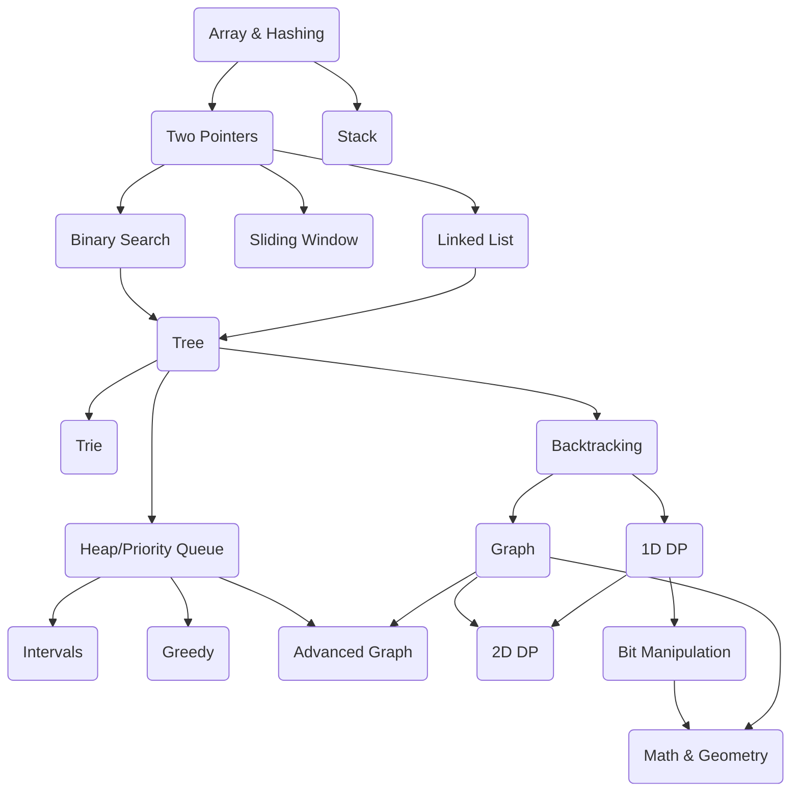

# LeetCode Top Interview Questions


## Array & Hashing

#### [217. Contains Duplicate](https://leetcode.com/problems/contains-duplicate/)


**Keyword**: Hashing

**Steps**
+ Keep pushing element into `std::unordered_set` until we find duplicated one

#### [383. Ransom Note](https://leetcode.com/problems/ransom-note/)

**Keyword**: Hashing

**Steps**
+ Use hash table to count occurrence of each letter
+ Knowing all the characters are letter, we can use array instead of hash table

#### [242. Valid Anagram](https://leetcode.com/problems/valid-anagram/)


**Keyword**: Hashing

**Intuition**
+ Use `std::array` to calculate the frequency of characters

**Steps**
+ If not same size, return false
+ Declare array of `freqs`
+ For the first string, add up
+ For the second string, count down
+ Check if all the elements in `freqs`

#### [49. Group Anagrams](https://leetcode.com/problems/group-anagrams/)


**Keyword**: Hashing

**Steps**
+ Declare groups, {key: encoded character frequency, value: strings}
+ Iterate all strings
  + Calculate the character frequency (Or use a 26 length array)
  + Turn frequency to string
  + Update groups
+ Flatten the groups

Time: O(N * K), Space: O(N * K), K is string length

#### [1. Two Sums](https://leetcode.com/problems/two-sum/)


**Keyword**: Hashing

**Steps**
+ Use hash map to store the visited value and its index
+ Iterate the numbers
  + If `target - nums[i]` exists in hashtable, append to result
  + Else insert new pair

#### [347. Top K Frequent Elements](https://leetcode.com/problems/top-k-frequent-elements)


**Keyword**: Min-Heap

**Intuition**
+ Use min heap to track the k largest number by contraint the size to k

**Steps**
+ Declare hash map to store the number frequency
+ Iterate the hash map
  + Push current {count, number} pair to min heap
  + If min heap size is more than k, pop the top (smallest one)
+ Build results

Time: O(NLog(K)), Space: O(N)

#### [271. Encode and Decode Strings](https://leetcode.com/problems/encode-and-decode-strings/)


**PROBLEM STATEMENT**

Design an algorithm to encode a list of strings to a single string, and decode it back to the original list.
Implement two functions:
+ `string encode(const vector<string>& strs)`
+ `vector<string> decode(const string& s)`

**Keyword**: Array, String

**Intuition**
+ Encode by string length and '#'

**Solution**
```cpp
class Codec {
public:
    std::string encode(const std::vector<std::string>& strs) {
        std::string s;
        for (const auto& str: strs) {
            s += std::to_string(str.size()) + "#" + str;
        }
        return s;
    }

    std::vector<std::string> decode(const std::string& s) {
        std::vector<std::string> strs;
        int i = 0;
        while (i < s.size()) {
            auto j = i;
            while (s[j] != '#') {
                j++;
            }

            const auto len = std::stoi(s.substr(i, j - i));
            strs.push_back(s.substr(j + 1, len));
            i = j + 1 + len;
        }

        return strs;
    }
}
```

#### [238. Product of Array Except Self](https://leetcode.com/problems/product-of-array-except-self/)


**Keyword**: Array

**Intuition**
+ We can't use divide
+ We compute the product of at index i from left product and right product

**Steps**
+ Declare the `res` array of size n, initialize with 1
+ Iterate from left to right, starting at 1 to calculate
  + res[i] = res[0] * res[1] * ... * res[i - 1]
+ Iterate from right to left, starting at n - 1 to calculate
  + Multiply the values in right parts

#### [128. Longest Consecutive Sequence](https://leetcode.com/problems/longest-consecutive-sequence/)


**Keyword**: Array

**Intuition**
+ Since the time complexity should be O(n), so we can't sort
+ We try to use hash set to make the query faster O(1)
+ Try to find the starting value, and extend as much as possible

**Steps**
+ Declare hash set, transform the nums into hash set
+ Iterate the **set** (IMPORTANT!!! As the test case may contain a lots of duplicated values)
  + Start only when current number is **start** (`num - 1` not inside hash set)
    + Count the length of the sequence starts with this number
    + Update longest length

## Stack

#### [20. Valid Parentheses](https://leetcode.com/problems/valid-parentheses/)


**Keyword**: Stack, Two-Pointer

**Steps**
+ Define hash map to store Parentheses. {close -> open}
+ Use a stack to hold the pending open brackets
+ Iterate string
  + If open, push to stack
  + If close
    + If stack empty, or stack top (last) not equal to corresponding open, return false
    + Else pop

#### [22. Generate Parentheses](https://leetcode.com/problems/generate-parentheses/)


**Keyword**: Stack, Backtrack

**Intuition**
+ Add open as much as possible (less than n)
+ Add close when close is less than open

**Steps**
+ Define `dfs` function
  + Input: current string, open count, close count, total parenthese need, combination so far
  + Output: void
  + Base condition: If current string size is equal to `2*n` 
    + Append current string and return
  + If open count is less than total need, append open
  + If close count is less than open count, append close
+ Start with `"", 0, 0, n, res`

#### [155. Min Stack](https://leetcode.com/problems/min-stack/)


**Keyword**: Stack

**Intuition**
+ We can sort every time when we want to get the min, so we need to cache the min
+ When we insert element, we also insert the min at that moment

**Steps**
+ Declare internal container: `std::stack<std::pair<int, int>>`
+ When we insert the value, also insert current min

**Variant**
+ [716. Max Stack](#716-max-stack)

#### [716. Max Stack](https://leetcode.com/problems/max-stack/)


**PROBLEM STATEMENT**

Design a max stack that supports push, pop, top, peekMax and popMax.
+ push(x) -- Push element x onto stack.
+ pop() -- Remove the element on top of the stack and return it.
+ top() -- Get the element on the top.
+ peekMax() -- Retrieve the maximum element in the stack.
+ popMax() -- Retrieve the maximum element in the stack, and remove it. If you find more than one maximum elements, only remove the top-most one.

**Keyword**: Stack

**Solution**
```cpp
class MaxStack {
public:
    void push(int x) {
        _data.push_back(x);
        _valToIt[x].push_back(_data.rbegin());
    }

    int pop() {
        auto val = _data.back();
        _data.pop_back();

        _valToIt[val].pop_back();
        if (_valToIt[val].empty()) {
            _valToIt.erase(val);
        }

        return val;
    }

    int top() const {
        return _data.back();
    }

    int peekMax() const {
        return _valToIt.rbegin()->first;
    }

    int popMax() {
        auto it = _valToIt.rbegin();
        int max = it->first;

        auto lastIt = it->second.back();
        _data.erase(lastIt);
        it->second.pop_back();
        if (it->second.empty()) {
            _valToIt.erase(max);
        }

        return max;
    }

private:
    using _Container = std::vector<int>;
    _Container _data;
    std::map<int, std::vector<_Container::iterator>> _valToIt;
};
```

**Variant**
+ What if we don't need `popMax()`, how can we improve the algorithm?

```cpp
namespace {

class MaxStack {
public:
    void push(int x) {
        if (_data.empty()) {
            _max = x;
            _data.push(x);
        } else if (x > _max) {
            _data.push(encode(x));
            _max = x
        } else {
            _data.push(x);
        }
    }

    void pop() {
        if (_data.empty()) {
            return; 
        }

        auto top = _data.top();
        _data.pop();

        if (top > _max) {
            _max = decode(top);
        }
    }

    int top() const {
        if (_data.empty()) {
            // ... throw Exception();
        }

        auto top = _data.top();

        return top > _max ? _max : top;
    }

    int peekMax() const {
        if (_data.empty()) {
            // ... throw Exception();
        }

        return _max;
    }
  
private:
    int encode(int x) const {
        return 2 * x - _max;
    }

    int decode(int top) const {
        return 2 * _max - top;
    }
private:
    using _Container = std::stack<int>;
    _Container _data;
    int _max = -1;
};
```

#### [150. Evaluate Reverse Polish Notation](https://leetcode.com/problems/evaluate-reverse-polish-notation/)


**Keyword**: Stack

**Intuition**
+ Use stack to hold the pending numbers
+ Follow Polish Notation operation

#### [739. Daily Temperatures](https://leetcode.com/problems/daily-temperatures/)


**Keyword**: Stack

**Intuition**
+ Use a **monotonic stack** to remember **indices** of days with cooler (or same) temperatures.
As soon as we find a warmer temperature, we can pop previous days.

**Steps**
+ Declare stack for the decresing temperature **indices**
+ Declare results, initialize with 0
+ Iterate temperatures
  + If we find current temp is higher than the temps in the stack
    + Pop out
    + Append the index diff as result
  + Push temp to stack
+ Return results

Time: O(N), Space: O(N)

#### [853. Car Fleet](https://leetcode.com/problems/car-fleet/)


*Question?*

**Keyword**: Stack

**Intuition**

#### [84. Largest Rectangle in Histogram](https://leetcode.com/problems/largest-rectangle-in-histogram/)


*Question?*

**HARD**

**Keyword**: Stack

**Intuition**
+ Compare with [11. Contain with Most Water](#11-container-with-most-water), which is different
+ Each bar has the potential to be the smallest bar
+ We try to extend current as much as possible until we meet a smaller bar
+ Use min stack for this

**Steps**
+ Push a 0 to input heights (**IMPORTANT**)
+ Declare mono up stack, max area
+ Iterate the heights
  + If stack not empty, current height is smaller than the highest so far (top of the stack)
      + Need to update the max area
      + height is the stack top
      + w is `i - 2nd highest index - 1` (bcs not include the current index)
      + Update max area
  + Push current index (default)
+ Return max area

## Two-Pointer

#### [11. Container with Most Water](https://leetcode.com/problems/container-with-most-water/)


**Keyword**: Two-Pointer

**Intuition**
+ `area = std::min(heights[left] + height[right]) * (heights[right] - height[left])`
+ Move the lower height to maximize the area

**Steps**
+ `left`: 0, `right`: n - 1
+ Declare `maxArea`
+ While `left` and `right` not cross
  + Calculate and update `maxArea`
  + Move the smaller side to update bound

Time: O(N), Space: O(1)

#### [42. Trapping Rain Water](https://leetcode.com/problems/trapping-rain-water/)


**HARD!!!**

**Keyword**: Two-Pointer

**Observations**
+ Water volumn can be trapped depends on the lower side
+ Water that can be trapping at index i is `std::min(leftMax, rightMax) - h[i]`

**Steps**
+ Two pointers start at begining and end
+ When the two pointers not cross, loop
  + If left is smaller, check left side
    + Check if need to update `leftMax`
    + Calculate water at current index
    + Move left pointer
  + If right is small, check right side
    + Check if need to update `rightMax`
    + Calculate water at current index
    + Move right pointer

Time: O(N), Space: O(1)

## Binary Search

#### [704. Binary Search](https://leetcode.com/problems/binary-search/)


**Keyword**: Binary Search

**Intuitions**
+ Classic binary search

**Steps**
+ `left` at 0, `right` at `size - 1`
+ while `left` and `right` not cross
  + Calculate `mid`
  + If val at `mid` is `target`, return `mid`
  + Else if small than `target`, move left to `mid+1`
  + Else if larger than `target`, move right to `mid-1`

#### [74. Search a 2D Matrix](https://leetcode.com/problems/search-a-2d-matrix/)


**Keyword**: Binary Search

**Intuitions**
+ Classic 2d binary search

**Steps**
+ All the processes are the same as [704. Binary Search](#704-binary-search)
+ Except the total length is `m*n`, and we need to use length to get row and col

#### [875. Koko Eating Bananas](https://leetcode.com/problems/koko-eating-bananas/)


**Keyword**: Binary Search

**Intuition**
+ The more bananas Koko eats per hour, the fewer hours she needs.
+ We can binary search for the minimum valid speed `k` between 1 and the maximum in `piles`.

**Steps**
+ Write a helper function: Given eating speed `k`, check can eat all or not?
  + Iterate piles
    + Use `(pile + k - 1)` to efficiently calculate `std::ceil(pile / (double)k)`
+ Binary search loop
  + `left`: 1 (min eat one banana), `right`: max of pile
  + If can eat all, slow down, move right
  + Else, speed up, move left
+ Return left

Time: O(nLog(max)), each check takes O(n), binary search take O(log(max)), Space: O(1)

#### [153. Find Minimum in Rotated Sorted Array](https://leetcode.com/problems/find-minimum-in-rotated-sorted-array/)


*REVISIT*

**Keyword**: Binary Search

**Intuition**
+ We compare with nums[right], not nums[left], to detect rotation direction.
+ When nums[mid] > nums[right], rotation point is on the right side.
+ When nums[mid] <= nums[right], we include mid in the next search (could be the minimum).

**Steps**
+ Translate the intuition into code

#### [33. Search in Rotated Sorted Array](https://leetcode.com/problems/search-in-rotated-sorted-array/)


**Keyword**: Binary Search

**Intuition**
+ Even though rotated, one half of it is still sorted (ascendingly), we can use modified binary search
  + Check which side is sorted
  + Narrow search

**Steps**
+ `left` at 0, `right` at end
+ While `left <= right`
  + Calculate `mid`
  + If `nums[mid] == target`, return `mid`
  + If `nums[left] <= nums[mid]` (left side sorted)
    + If `target` also in left range, move right
    + Else, move left
  + Else (right side sorted)
    + If `target` also in right range, move left
    + Else, move right
+ Return invalid

#### [981. Time Based Key-Value Store](https://leetcode.com/problems/time-based-key-value-store/)


**Keyword**: Binary Search

**Intuition**
+ The input timestamps are **strictly increasing**, so we don't need to sort the value
+ Among a sorted array, find the biggest value smaller than target

**Steps**
+ Internal container: `std::unordered_map<std::string, std::vector<std::pair<int, std::string>>>`
+ Use binary search to find the result

#### [4. Median of Two Sorted Arrays](https://leetcode.com/problems/median-of-two-sorted-arrays/)


**HARD!!!**

**Keyword**: Binary Search

**Intuition**
+ We are required to finish in O(log(m + n)), so we can't merge and sort (O(nlog(n)))
+ Try to partion both arrays at index `AMid` and `BMid`, such that: `AMid + BMid == (m + n + 1) / 2`
+ Check if all the left parts are less equal than all the right parts
+ Tricks
  + Always binary search the shorter one
  + Be careful about the edge cases at start and end

**Steps**
+ Always binary search on the smaller array.
+ Partition both arrays at index i and j such that: `i + j == (m + n + 1) / 2` (ensures left and right parts are balanced)
+ Use INT_MIN and INT_MAX to avoid boundary issues.
+ Check if:
  + Aleft <= Bright and Bleft <= Aright
  + If not, adjust binary search (low/high)
+ Once the correct partition is found:
  + If total length is odd: return max(left parts)
  + If even: return average of max(left parts) and min(right parts)

#### [167. Two Sums II](https://leetcode.com/problems/two-sum-ii-input-array-is-sorted/)


**Keyword**: Binary Search

**Intuition**
+ The difference with [1. Two Sums](#1-two-sums) is the input array is sorted
+ We can use two pointer method to find the two sums pair
+ The other difference is given array is **1-indexed**

**Steps**
+ Two pointers, `left` at 0, `right` at end
+ While `left` and `right` don't cross
  + If current sum is target, return index
  + If current sum is less, move left
  + If current sum is more, move right

#### [15. 3Sums](https://leetcode.com/problems/3sum/)


**Keyword**: Binary Search

**Intuition**
+ Need to return **all** triplets
+ Fixed one number, and the rest is [167. Two Sums II](#167-two-sums-ii)

**Steps**
+ Sort the numbers
+ Iterate the numbers
  + Skip if current number is dupliacted (use the first one in duplicated sequence)
  + Break if current number is positive (not possible to find triplet in the rest sorted array)
  + Start [Two Sums II](#167-two-sums-ii), with
    + `target = -num[i]`
    + `left = i + 1`, `right = end`
    + If less ...
    + If more ...
    + If equal, remember to keep moving `left` and `right` until no duplicated

Sorting: O(nlogn)
Searching: O(n^2)

#### [18. 4Sum](https://leetcode.com/problems/4sum/)


**Keyword**: Binary Search

**Inuition**
+ Similar to [15. 3Sum](#15-3sums), but try to fix two positions
+ **BE CAREFUL** of
  + Duplicated numbers
  + Sum overflow

**Steps**
+ Sort the numbers
+ First index loop
  + Skip the duplicated numbers
  + Second index loop
    + Skip the duplicated numbers
    + Binary Search
      + `left`: j + 1, `right`: n - 1
      + Start loop
        + If sum == target, append to results, skip duplicated numbers
        + If sum < target, move left
        + If sum > target, move right
+ Return results

Time: O(n^3)

## Sliding Window

#### [121. Best Time to Buy and Sell Stock](https://leetcode.com/problems/best-time-to-buy-and-sell-stock/)


**Keyword**: Sliding Window

**Observations**
+ Buy and sell should happen on different day
+ One operation

**Intuition**
+ Buy low, sell high

**Steps**
+ Track min price and max profit so far
+ Iterate prices
  + Update min price
  + Update potential max profit

Time: O(N), Space: O(1)

#### [122: Best Time to Buy and Sell Stock II](https://leetcode.com/problems/best-time-to-buy-and-sell-stock-ii/)

**Observations**
+ Buy and sell can happen in the same day
+ Hold at most one stock
+ Multiple operations

**Intuition**
+ Capture All Uptrends: buy at every valley, sell at every peak
+ Avoid Overlapping Trade
  + Even it's possible stock increases for several day, but we should make use of the rule from the question

**Steps**
+ Iterate prices
  + Every increase is an oppotunity to make profit
  + Sum up all the increase

Time: O(N), Space: O(1)

#### [3. Longest Substring Without Repeating Characters](https://leetcode.com/problems/longest-substring-without-repeating-characters/)


**Keyword**: Sliding Window

**Intuition**
+ Use the sliding window technique to maintain a substring without repeating characters while iterating through the string.
If a character is repeated, move the left pointer of the window forward to exclude the previous occurrence.

**Steps**
+ Use two pointers, `left` and `right` start at `0`
+ Declare hash map to record the last seen character index, {character, index}
+ Iterate the string (with `right`)
  + If current character is seen and in range of the window
    + Update `left` to next index of the seen character index
  + Update `lastSeen` of current position (`right`)
  + Update max length
+ Return max length

Time: O(N), Space: O(A), where A is the size of the character size

#### [424. Longest Repeating Character Replacement](https://leetcode.com/problems/longest-repeating-character-replacement/)


**Keyword**: Sliding Window

**Intuition**
+ Track the max count letter inside window so far
+ We try to change the rest of the letters into the max count letter
+ If not enough chances to change, shrink left

**Steps**
+ Declare window letter frequency, max window letter frequency, left at 0, max window len
+ Iterate the string
  + Update window letter frequency
  + Update max window letter frequency
  + while not enough chances to change the rest of letters
    + Decrease left letter frequency
    + Shrink left
  + Update max window length
+ Return max window length

#### [567. Permutation in String](https://leetcode.com/problems/permutation-in-string/)


**Keyword**: Sliding Window

**Intuition**
+ A classic sliding window problem to calculate the frequency of string
+ A permutation should have **same size and size frequency**
+ Use `std::array` instead of `std::unordered_map`, because we would decrease the value, when value goes to 0, the entry still exists

**Steps**
+ Calculate the frequency of target string
+ Calculate the frequency of the first window of target string size
+ If the window frequency is the same, return true
+ Else iterate from the next index, move window
  + Increase the new element count
  + Decrease the last element count
  + If the window frequency is the same, return true
+ Default return false

#### [76. Minimum Window Substring](https://leetcode.com/problems/minimum-window-substring/)


**HARD**

**Keyword**: Sliding Window

**Intuition**
+ Count the frequency in `template`
+ Using sliding window to expand and contract as needed
+ Track how many characters have met required count

**Steps**
+ Declare template frequency map: {char -> int}
+ Count the frequency in `template`
+ Declare sliding window
  + Window frequency map: {char -> int}
  + Window start
  + Window length
+ Two pointers loop. `right` as expand iterator, `left` as contract iterator
  + Get current `right`, and move on (expand)
    + If this character is needed
      + Window frequency increase
      + If the frequency is same, match counter increase
  + If match counter is same as need (meaning we have all the characters, but frequency may not correct), try to contract
    + If current length is smaller, update min window length
    + Get current `left`, and move on (expand)
      + If this character is needed
        + If the frequency is same, match counter decrease
        + Window frequency decrease
+ Return substring

Time: O(len(string), len(template)), Space: O(len(template))

#### [239. Sliding Window Maximum](https://leetcode.com/problems/sliding-window-maximum/)


**HARD**

**Keyword**: Sliding Window

**Intuition**
+ Brutal force: scan each window, cost O(nk)
+ Use `deque` to store `indices` of useful elements in window

**Steps**
+ Declare a deque to keep indices of elements that are candidates for max
+ Iterate `nums`
  + Remove the outside indices from the front
  + Remove small indices from the back
  + If i in range, append deque front (indices with larger value)

## Linked List

#### [206. Reverse Linked List](https://leetcode.com/problems/reverse-linked-list/)


**Keyword**: Linked-List

**Steps**
+ Declare a `prev` points to `nullptr`
+ Declare a `current` points to the head
+ while current valid
  + Cache `next`
  + `current`'s next points to `prev`
  + `prev` move to `current`
  + `current` move to next

#### [92. Reverse Linked List II](https://leetcode.com/problems/reverse-linked-list-ii/)

**Keyword**: Linked-List

**Intuition**
+ Difference between [206. Reverse Linked List](#206-reverse-linked-list) is reverse list in a range

#### [25. Reverse Nodes in k-Group](https://leetcode.com/problems/reverse-nodes-in-k-group/description/)


**HARD!!**

**Keyword**: Linked-List

#### [876. Middle of the Linked List](https://leetcode.com/problems/middle-of-the-linked-list/)

**Keyword**: Linked-List, Two-Pointer

**Intuition**
+ Slow and fast pointer. When fast meets the end, return the slow

#### [141. Linked List Cycle](https://leetcode.com/problems/linked-list-cycle/)


**Keyword**: Linked-List, Two-Pointer

**Intuition**
+ Slow and fast pointer. When fast meets slow, then there's a cycle

#### [142. Linked List Cycle II](https://leetcode.com/problems/linked-list-cycle-ii/)

**Keyword**: Linked-List, Two-Pointer

**Intuition**
+ Difference with [141. Linked List Cycle](#141-linked-list-cycle) is the problem requires return the entry of the loop
+ Detect loop part is the same. After we find a loop, place a node in the beginning, and move together with slow

#### [237. Delete Node in a Linked List](https://leetcode.com/problems/delete-node-in-a-linked-list/)


**Keyword**: Linked-List

**Intuition**:
+ Can't access head, and we don't know prev, so we can't simply unlink this node
+ We can **copy the next node** into current node, and delete next node

#### [143. Reorder List](https://leetcode.com/problems/reorder-list/)


**Keyword**: Linked-List

**Intuition**
+ Split the Linked List into two parts, be careful
  + Remember to break the Linked List, meaning make last node of first part point to `nullptr`
  + Two way to break a Linked List, one is len(first) >= len(second), the other one is len(first) <= len(second)
+ Reverse the second part
+ Merge two parts together

**Steps**
+ ...

#### [21. Merge Two Sorted Lists](https://leetcode.com/problems/merge-two-sorted-lists/)


**Keyword**: Linked-List

**Intuition**
+ Since both lists are sorted, we can iterate through both and merge them in order.

**Steps**
+ Create `dummy` node
+ Declare `current` node starts at dummy
+ While both list not to the end
  + Link the smaller node, and move forward
+ Link the rest list

Time: O(n+m), Space: O(1)

#### [148. Sort List](https://leetcode.com/problems/sort-list/)


**Keyword**: Linked-List

**Intuition**
+ Naturally think of merge sort
+ Split the linked-list with fast-slow pointer
+ Merge two part, check [21. Merge Two Sorted Lists](#21-merge-two-sorted-lists)

**Steps**
+ If `head` is `nullptr` or one head, return `head`
+ Use fast-slow pointer to split the list
+ Recursively call `sortList` on `head` and `slow`
+ Merge the result

Time: O(nlogn), Space: O(logn) of stack

#### [19. Remove Nth Node From End of List](https://leetcode.com/problems/remove-nth-node-from-end-of-list/)


**Keyword**: Linked-List, Two-Pointer

**Intuition**
+ For singly linked link, we can't access element by index, instead we have to count the move.
+ The distance between the earlier pointer and the later pointer keeps constant

**Steps**
+ `first` and `second` pointer start from `dummy` node
+ Move `first` for `n+1` steps forward
+ Then move both together until `first` hits the end
+ `second->next` is the one to remove

**Note**
+ Why `dummy` node?
+ Why move `n+1` steps?
  + To remove the nth from the end, we need to arrive at the one before last nth node
  + The `first` pointer stops at pos n

#### [138. Copy List with Random Pointer](https://leetcode.com/problems/copy-list-with-random-pointer/)


**MEDIUM BUT HARD**

**Keyword**: Linked-List

**Intuition**
+ The easiest way is to use an extra hash map to store {Old Node -> New Node}
+ The optimal solution is not easy to come up

**Approach: Hash map**
+ Declare hash map {Old Node -> New Node}
+ 1st pass: Copy node one by one, and update hash map
+ 2nd pass: Iterate the hash map, link next and random node of new node

**Approach: Interleaving**
+ 1st pass: Copy each node right after the original node (don't care random pointer)
+ 2nd pass: Link random pointer in the copied nodes
+ 3rd pass: Separate the copied nodes and original nodes, and recover the original nodes links.
  + Use dummy header

Time: O(N), Space: O(1)

#### [2. Add Two Numbers](https://leetcode.com/problems/add-two-numbers/)


**Keyword**: Linked-List

**Intuition**
+ Since numbers are stored in reverse order, adding them from head to tail is same as adding numbers

**Steps**
+ Declare a dummy pointer
+ Declare `curr` and `carrier`
+ Loop while `l1` and `l2` both valid
+ Loop either `l1` or `l2` valid
+ Append carrier node if it exists

#### [287. Find the Duplicate Number](https://leetcode.com/problems/find-the-duplicate-number/)


**Keyword**: Linked-List, Two-Pointer

**Intuition**
+ Notice some keyword "numbers from [1, n] in n+1 size array", "constant space complexity"
+ Treat the value of nums as pointer to next node
+ We try to find the circle, then find the entrance

**Steps**
+ ...

#### [146. LRU Cache](https://leetcode.com/problems/lru-cache)


**Keyword**: Doubly Linked-List

**Observations**
+ Both `get()` and `put()` are considered "used", So we use doubly linked list for efficient ordering
+ We can't use index to manipulate value in linked list, so we create a hash map {key, iterator}

**Steps**
+ Declare a doubly linked list (of {key, value} pairs) for the underlying container, front is the most used, end is the least used
+ Declare a hash map {key, iterator} to fast access data
+ `get()`
  + If not exist in map, return -1
  + If exist
    + Use the iterator to get value
    + Move this {key, value} to the front
      + Remove the iterator
      + Push new node to the front
      + Update map
+ `put()`
  + If exist in map
    + Use iterator to remove the existed one
  + If not exist in map
    + If exceed capacity
      + Get the last key
      + Pop last element
      + Remove from map
  + Push new node to the front
  + Update map

Time: O(1), Space: O(N)

#### [460. LFU Cache](https://leetcode.com/problems/lfu-cache/)

**HARD**

*TODO*

**Keyword**:

**Intuition**

**Steps**

## Binary Tree

#### [226. Invert Binary Tree](https://leetcode.com/problems/invert-binary-tree/)


**Keyword**: DFS on Tree

**Steps**
+ If nullptr, return nullptr
+ Swap `left` and `right`
+ `invertTree` on `left` and `right`
+ Return `root`

#### [104. Maximum Depth of Binary Tree](https://leetcode.com/problems/maximum-depth-of-binary-tree/)


**Keyword**: DFS on Tree

**Steps**
+ Small tree use DFS, deep trees use **BFS**.

#### [543. Diameter of Binary Tree](https://leetcode.com/problems/diameter-of-binary-tree/)


**Keyword**: DFS on Tree

**Intuition**
+ Diameter of a node is the longest path goes through the node
  + In other words, **the largest sum of left and right subtree height**
+ Because we need to calculate the height from bottom up, so use DFS

**Steps**
+ DFS recursion
  + Calculate the sum of left and right subtring height
  + Update the max diameter
  + Return height
+ Start recursion with root

Time: O(N), Space: O(H)

#### [110. Balanced Binary Tree](https://leetcode.com/problems/balanced-binary-tree/)


**Keyword**: DFS on Tree

**Intuition**

**Steps**
+ ...

#### [100. Same Tree](https://leetcode.com/problems/same-tree/)


**Keyword**: DFS on Tree

**Intuition**

**Steps**
+ ...

#### [572. Subtree of Another Tree](https://leetcode.com/problems/subtree-of-another-tree/)


**Keyword**: DFS on Tree

**Intuition**

**Steps**
+ ...

#### [236. Lowest Common Ancestor of a Binary Tree](https://leetcode.com/problems/lowest-common-ancestor-of-a-binary-tree/)


**Keyword**: DFS on Tree

**Intuition**
+ Use DFS to traverse the tree and locate LCA
+ Try [1650. Lowest Common Ancestor of a Binary Tree III](#1650-lowest-common-ancestor-of-a-binary-tree-iii), and you would find that if the node can access its parent, everything is better.
+ So the other option is to build a hash map of nodes and their parent first, and the problem is the same as [1650. Lowest Common Ancestor of a Binary Tree III](#1650-lowest-common-ancestor-of-a-binary-tree-iii)

**Steps**
+ DFS function
  + Return: the LCA
  + Inputs: node, taget1, target2
  + If `node` is null, return null
  + If any of `p` and `q` is `node`, return `node`
  + Recursively get left LCA and right LCA from left and right branch
  + If LCA exists on both sides, return `node`
  + Either `p` or `q` on one side of the `node`, LCA should be in that side of the `node`
+ Use DFS on left and right

**Notes**
+ Even we can reuse the `lowestCommonAncestor()` function, its intention is confusing(we can't always find LCA in the subtree!), we better use a new `dfs()` function to define what to do in DFS recursion

#### [1644. Lowest Common Ancestor of a Binary Tree II](https://leetcode.com/problems/lowest-common-ancestor-of-a-binary-tree-ii/)

**PROBLEM STATEMENT**

Given a binary tree, find the lowest common ancestor (LCA) of two given nodes `p` and `q`. However, this version of the problem has a special requirement:
+ If either `p` or `q` is missing from the tree, return `nullptr` instead of the LCA.

**Keyword**: DFS on Tree

**Intuition**
+ Similar to [236. Lowest Common Ancestor of a Binary Tree](#236-lowest-common-ancestor-of-a-binary-tree)
+ The `dfs` function carries more infos

**Solution**
```cpp
// Reuse the structure of basic LCA, but in dfs(), we carry the result if q and p exist in the tree, 
class Solution {
public:
    Node* lowestCommonAncestor(Node* root, Node* p, Node* q) {
        bool findP{false}, findQ{false};
        const auto lca = dfs(root, p, q, findP, findQ);
        return (findP && findQ) ? lca : nullptr;
    }

private:
    Node* dfs(Node* node, Node* p, Node* q, bool& findP, bool& findQ) {
        if (!node) {
            return nullptr;
        }
        
        bool leftFindP{false}, leftFindQ{false};
        const auto left = dfs(node->left, p, q, leftFindP, leftFindQ);
        bool rightFindP{false}, rightFindQ{false};
        const auto right = dfs(node->right, p, q, rightFindP, rightFindQ);

        findP = leftFindP || rightFindP || node == p;
        findQ = leftFindQ || rightFindQ || node == q;

        if (node == p || node == q) {
            return node;
        }
        if (left && right) {
            return node;
        }
        
        return left ? left : right;
    }
}
```

#### [1650. Lowest Common Ancestor of a Binary Tree III](https://leetcode.com/problems/lowest-common-ancestor-of-a-binary-tree-iii/)

**PROBLEM STATEMENT**

Given two nodes in a binary tree where each node contains a parent pointer, find their lowest common ancestor (LCA).

**Keyword**: Two-Pointer

**Steps**
+ Use two pointers, start at `p` and `q`
+ Move each pointer upward to its parent until they meet
+ If a pointer reaches the root (`parent = nullptr`), restart at the other node
  + Both pointers would traverse the same height in the end
+ The first common node encountered is the LCA

**Solution**
```cpp
// Node definition
// class Node {
//     int val;
//     Node* left;
//     Node* right;
//     Node* parent;
// };

class Solution {
public:
    Node* lowestCommonAncestor(Node* p, Node* q) {
        // Two pointers
        auto p1{p};
        auto p2{q};
        while (p1 != p2) {
            // 1. Move pointer upward to parent
            // 2. If pointer reaches nullptr, restart at the other's position
            p1 = p1 ? p1->parent : q;
            p2 = p2 ? p2->parent : p;
        }

        return p1;
    }
}
```

Time: O(H), Space: O(1)

#### [102. Binary Tree Level Order Traversal](https://leetcode.com/problems/binary-tree-level-order-traversal/)


**Keyword**: BFS on Tree

**Intuition**
+ Classic BFS

**Steps**
+ ...

#### [199. Binary Tree Right Side View](https://leetcode.com/problems/binary-tree-right-side-view)


**Keyword**: BFS on Tree

**Intuition**
+ Because we need to iterate the tree by layer, so BFS
+ The last node is the right most node in current layer
+ Optional: DFS. Add the right node first, so when list size is same as the depth, that's the right most node

**Steps**
+ Prepare BFS
  + Declare queue of Node
  + Push root
+ BFS loop
  + Iterate elements in layer
    + Update the last element
    + Insert left and right (if neccessary)
  + Append last number of this layer
+ Return result

Time: O(N), Space: O(N)

**Variants**
+ Left Side View: Same structure, but save the first node of the layer

#### [1448. Count Good Nodes in Binary Tree](https://leetcode.com/problems/count-good-nodes-in-binary-tree/)


**Keyword**: DFS on Tree, BFS on Tree


#### [88. Merge Sorted Array](https://leetcode.com/problems/merge-sorted-array/)


**Keyword**: Two-Pointer

**Steps**
+ Two pointers, all start from two end (`m-1` and `n-1`)
+ Iteration pointer starts from the very (`m+n-1`) end
  + If `nums[i1] > nums[i2]`, use `nums[i1]`, move i1
  + Else, use `nums[i2]`, move i2
  + Move i
+ Copy the rest from `nums`

Time: O(m+n), Space: O(1)

#### [27. Remove Item](https://leetcode.com/problems/remove-element/)

**Keyword**: Two-Pointer

**Intuition**
+ In-place
+ Only care about the elements that are not the same as target
+ Use an index to track the elements that are not the same as target

**Steps**
+ Declare `index`
+ Loop all the numbers
  + If not equal to `target`
    + Overwrite index
    + Index count up

#### [26. Remove Duplicates from Sorted Array](https://leetcode.com/problems/remove-duplicates-from-sorted-array/)


**Keyword**: Two-Pointer

**Intuition**
+ Slow pointer track the position of unique number, fast pointer to iterate array

**Steps**
+ `slow` start at 0
+ `fast` start at 1, iterate `fast`
+ Whenever find a unique element, increase `slow`, update value at `slow` to value as fast

#### [80. Remove Duplicates from Sorted Array II](https://leetcode.com/problems/remove-duplicates-from-sorted-array-ii/)

**Keyword**: Two-Pointer

**Intuition**
+ Similar to [26. Remove Duplicates from Sorted Array](#26-remove-duplicates-from-sorted-array)
+ The starting point and `if` condition are different. Generalize to max k duplicated.
+ First k element always valid.

#### [169. Majority Element](https://leetcode.com/problems/majority-element/)


**Intuition**
+ Because the majority element appears more than n / 2, so just sort and return the value at median

**Steps**
+ Sort
+ Return the value at median

#### [189. Rotate Array](https://leetcode.com/problems/rotate-array/)

**Steps**
+ Rotate all
+ Rotate first k
+ Rotate remaining

#### [55. Jump Game](https://leetcode.com/problems/jump-game/)


**Keyword**: Greedy

**Intuition**
+ Always try to find out the max jump position from current position

**Steps**
+ Track the max reachable index
+ Iterate the jumps
  + If current index > max reachable index, return false
  + Update max reachable index from current index
  + If new max reachable index is over the total, return true
+ Default return true

#### [45. Jump Game II](https://leetcode.com/problems/jump-game-ii/)


**Keyword**: Greedy

**Intuition**
+ The difference between this question and [Jump Game](#55-jump-game) is
  + **Return the minimum jump**
  + Destination is `nums[n - 1]`
+ **Greedy**: At each level, try to extend the jump range as far as possible

**Steps**
+ Declare the farthest index we can reach by `farthest`
+ Declare the current range of jump by `currentRange`
+ Declare jump count
+ Iterate `[0... n-1)`
  + Update `farthest`
  + If we reach `currentRange`, we must jump
    + Increase the `jump` counter
    + Update `currentRange`

## Intervals

#### [228. Summary Ranges](https://leetcode.com/problems/summary-ranges/)

**Keyword**: Two-Poiner

**Steps**
+ one point to the range start, one is iterating
+ **Be creaful of the condition**

#### [733. Flood Fill](https://leetcode.com/problems/flood-fill/)

**Keyword**: BFS on Grid

**Steps**
+ Declare queue of position
+ Insert starting point
+ while queue not empty loop
  + Retrieve front position
  + Save old color
  + Assign new color
  + Try 4 directions
    + If out of boundary, or not same color, or same as new color, skip
    + Append position
+ Return results

#### [200. Number of Islands](https://leetcode.com/problems/number-of-islands/)


**Keyword**: BFS on Grid, DFS

**Intuition**
+ When we meet a land, try to sink its adjacent lands until we can't

**Steps: BFS (Recommend)**
+ Return if `grid` is empty
+ Declare queue to keep pending **lands**
+ Iterate the grid
  + If current cell is land
    + Sink
    + Count up
    + Add to queue
    + Iterate pending lands (if appplicable)
      + For each land, try 4 directions
        + If cell is in range and is a land
          + Sink
          + Add to queue
+ Return count

Time: O(m x n), Space: O(m x n)

#### [695. Max Area of Island](https://leetcode.com/problems/max-area-of-island/)


**Keyword**: BFS on Grid

**Intuition**
+ An island problem, use flood fill
+ When flood fill, calculate the current area, then update the max area

**Steps**
+ ...

#### [934. Shortest Bridge](https://leetcode.com/problems/shortest-bridge/)


**Keyword**: DFS, BFS on Grid

**Intuition**
+ Try to locate and mark the first island (using 2) with DFS
+ Use BFS from all the boundary points of the first island to expand toward the second
+ The first point touch the second island is the shortest bridges

**Steps**
+ Find and mark the first island
  + Declare `dfs()` function
    + Input: grid, row, col, queue
    + Output: None
    + If not in range or not island, return
    + Mark visited as 2, and push land into queue
    + Explore 4 directions
+ Start BFS loop
  + Retrieve island in queue
  + Try 4 directions
    + If not in range, skip
    + If meet island, return `len`
    + If meet sea
      + Mark as visited
      + Append to queue

Time: O(n^2), Space: O(n^2)

#### [827. Making A Large Island](https://leetcode.com/problems/making-a-large-island/)

**HARD**

**Keywords**: DFS

**Intuition**
+ When we change a cell from sea into land, it also connect the neighbor lands together
+ Label all islands with unique ids, and save their size
  + ID should starts from 2, because 0 is for water, 1 is for OG land(a.k.a. unvisited land)
+ Try to turn each water into land, and calculate the new island size, update max island size
  + Use `set` to avoid duplicated

**Steps**
+ Declare hash map, {Island Id -> Island Size}
  + Id starts from 2
+ 1st pass: Iterate cells, use DFS calculate size. 
+ DFS function: return size, log visited (with Id), carry the Island size map
  + If not in bound, or not unvisited land, return 0
  + If in bound
    + Update Id
    + Explore 4 directions, (size from 1)
+ 2nd pass: Find current max island size
+ 3rd pass: Iterate cells, locate water and try to fill
  + Explore 4 directions, and add neighbor
  + Sum up to calculate new size
  + Update new max size

Time: O($N^2$), Space: O($N^2$)

#### [542. 01 Matrix](https://leetcode.com/problems/01-matrix/)


**Keyword**: BFS on Grid

**Intuition**
+ Multicore BFS
+ Start BFS from 0s (instead of 1s), which is faster
+ Initialize all the 1s to INT_MAX to indicate "no visited"

#### [994. Rotting Oranges](https://leetcode.com/problems/rotting-oranges/)


**Keyword**: BFS on Grid, Flood-Fill

**Intuition**
+ Classic BFS flood-fill problem
  + Multi sources, starts from rotten oranges
  + Process layer by layer (min by min)
  + Count min as BFS depth

**Steps**
+ Traverse grid to prepare BFS
  + Push rotten pos into queue
  + Count fresh count
+ BFS loop
  + Iterate all the rotten oranges in this layer
    + Try 4 directions
      + If out of range or not fresh, skip
      + Else rotten, push back to queue, decrease fresh count
  + Minute add up
+ Return if no fresh left or not

#### [864. Shortest Path to Get All Keys](https://leetcode.com/problems/shortest-path-to-get-all-keys/)


**Keyword**: BFS on Grid

**Intuition**
+ First thought BFS with visited
+ For the `visited`, we have more than one state. e.g. visit without any key, and visit with 1 key are different
+ So we use some kinda of flag to represent state
+ State: `std::bit_set` vs `std::array<bool, Size>`
  + We need to distinguish "not visit", "visited without key", "visited with ** key"
  + `std::bit_set` can't represent "visited without key" state
  + Prefer `int`, more compact

**Steps**
+ Define `struct State { int r, c; int key_state; };`
+ Declare state queue: `std::queue<State>`
+ Declare `visited` as `std::vector<std::vector<std::array<bool, TotalState>>>`
+ Declare `total_keys`
+ Iterate `grid` to find starting point and `total_keys`
  + If we meet starting point
    + Enqueue
    + Update `visited` with true at 0, meaning "visited without key"
  + If we meet key, set flag
+ Declare steps
+ `bfs` loop starts
  + Layer by layer, for each element in this layer
    + If already have all the keys, return steps
    + Try to expand 4 directions, for each directions
      + If out bound, skip
      + If meet wall, skip
      + If meet lock, but don't have this key, skip
      + Declare new_key_state
      + If meet key, update new_key_state
      + If visit current pos with new_key_state, skip
      + Update visited at current pos with new_key_state to true
      + Enqueue
  + Steps count up
+ Default return -1

#### [127. Word Ladder](https://leetcode.com/problems/word-ladder/)


**Keyword**: BFS on Graph

**Steps**
+ Put words into hash set
+ Return if `endWord` is not in the set
+ Declare queue of {string, depth} pair for later BFS
+ Declare hash set of visited strings
+ BFS loop
  + For each word, try to replace each character from 'a' to 'z' (two loops)
  + If new word is end word, return `depth + 1`
  + If new word is inside the set, and never visited, append to queue

#### [207. Course Schedule](https://leetcode.com/problems/course-schedule/)


**Keyword**: BFS on Graph

**Key Idea**
+ "In Degree"
  + Definition: In a directed graph, the in-degree of a node is the number of edges pointing into it. The out-degree is the number of edges leaving it.
  + In topological sort, we
    + Start with the node that have 0 in-degree
    + Then process and reduce the in-degree of the neighbor nodes

**Intuition**
+ All the prerequisities form a **directed graph**
+ Start from the courses with no prerequisities (0 degree)
+ Return true if we can iterate all the nodes

**Steps**
+ Iterate the prerequisites, to
  + Build a graph, from pre course point to course
  + Track in-degree of the course
+ Start with the course having 0 in-degree
+ BFS
  + Process: Count up the taken course
  + Reduce the in-degree of the next courses (neighbors)
+ The taken courses count should be equal to number of courses

Time: O(N + E), Space: O(N + E)

#### [210. Course Schedule II](https://leetcode.com/problems/course-schedule-ii/)


**Intuition**
+ Same as [207. Course Schedule](#207-course-schedule)
+ Change BFS Process: append current course

Time: O(N + E), Space: O(N + E)

## Binary Operation

#### [67. Add Binary](https://leetcode.com/problems/add-binary/)

+ Simulate binary addition (with two pointers)

#### [638. Shopping Offers](https://leetcode.com/problems/shopping-offers/)


**Keyword**: DFS

**Intuition**
+ Try **ALL** possible combinations of special offers to minimize the cost
+ Use DFS (recursion) with memoization to explore state space

**Steps**
+ Declare `dfs(...)` function
  + Input: prices, offers, needs
  + Output: min cost
  + If in memo, retrieve and return
  + Base case: without special offers
  + Try each offer
    + Offer valid if all the needs is greater and equal to item in offer
    + Deduct the offer item count from need
    + Try to calculate new min cost with new needs
  + Update min cost of current need
  + Return min cost
+ Start dfs with given prices, offers and needs

#### [103. Binary Tree Zigzag Level Order Traversal](https://leetcode.com/problems/binary-tree-zigzag-level-order-traversal/)


**Keyword**: BFS on Tree

**Intuition**
+ Almost the same as binary tree level traverse
+ Except we need one more boolean to indicate the direction, reverse the values in level based on the direction

#### [314. Binary Tree Vertical Order Traversal](https://leetcode.com/problems/binary-tree-vertical-order-traversal/)

**PROBLEM STATEMENT**

Given the `root` of a binary tree, return its vertical order traversal.
+ Nodes in the same vertical are ordered from top to bottom.
+ If multiple nodes are in the same position, they appear in left-to-right order.

**Keyword**: BFS

**Intuition**
+ Top to bottom, left to right, so use BFS
+ During BFS, track the column
+ `column = column_parent +/- 1`, and `root_column = 0`

**Approach**
```cpp
// Definition for a binary tree node.
// struct TreeNode {
//     int val;
//     TreeNode *left;
//     TreeNode *right;

//     TreeNode(int val = 0): TreeNode(val, nullptr, nullptr) {}
//     TreeNode(int x, TreeNode *left, TreeNode *right): val(x), left(left), right(right) {}
// };

// Intuition: BFS with column tracking
class Solution {
public:
    std::vector<std::vector<int>> verticalTraversal(TreeNode* root) {
        if (!root) {
            return {};
        }
        
        // We need a ordered map to store Column -> Nodes' value
        std::map<int, std::vector<int>> col_nodes;

        // For the BFS queue, we store Node -> Column
        std::queue<std::pair<TreeNode*, int>> q;
        q.push({root, 0});
        
        // BFS
        while (!q.empty()) {
            auto [node, column] = q.front();
            q.pop();

            col_nodes[column].push_back(node->val);

            if (auto left = node->left) {
                q.push({left, column - 1});
            }
            if (auto right = node->right) {
                q.push({right, column + 1});
            }
        }

        std::vector<std::vector<int>> res;
        for (const auto& [_, nodes]: col_nodes) {
            res.push_back(nodes);
        }

        return res;
    }
};
```

Time: O($Nlog(N)$), Space: O(N)

#### [987. Vertical Order Traversal of a Binary Tree](https://leetcode.com/problems/vertical-order-traversal-of-a-binary-tree/)

**HARD**

**Keyword**: BFS

**Intuitions**
+ The different with [314. Binary Tree Vertical Order Traversal](#314-binary-tree-vertical-order-traversal) is that if there multiple nodes in the same row and same column, sort these nodes by their values.
+ We could reuse the same structure, but change `std::vector<int>` to `std::map<int, std::multiset<int>>`, meaning "row -> sorted nodes" 
+ Optionally we can use DFS with sorting

**Approach: DFS with Sorting**
+ DFS to traverse all nodes with (col, row)
+ Sort the nodes by, with the container of map<col, map<row, multiset<val>>>
  + Column(left->right)
  + Row(top->bottom)
  + Value(ascending)
+ Build the result

Time: O($Nlog(N)$), Space: O(N)

#### [863. All Nodes Distance K in Binary Tree](https://leetcode.com/problems/all-nodes-distance-k-in-binary-tree/)


**MEDIUM BUT HARD!**

**Keyword**: Binary Tree, BFS on Graph

**Intuition**
+ We are given a tree, but the problem is more like a graph, so we **build a undirected graph from tree**
+ Use BFS to traverse the graph, and find all the paths of length k

**Steps**
+ Build undirected graph from tree
  + Inputs: node, parent
  + Append parent to node's neigbors, append node to parent's neigbors
  + Recursively build left and right
+ Prepare BFS queue, and visited set
+ Declare distance (depth), init as 0
+ Start the loop
  + If distance is k, break
  + Else iterate elements in current distance
    + Pop the front
    + Insert its neigbors (is not visited)
  + Distance count up
+ Return the elements in the queue

Time: O(N) + O(N), Space: O(N)

#### [124. Binary Tree Maximum Path Sum](https://leetcode.com/problems/binary-tree-maximum-path-sum/)


**HARD**

**Keyword**: DFS on Tree

**Intuition**
+ We want to know the **max** sum, so think of DFS
+ DFS function track the max sum and the max gain (from single side)

**Steps**
+ DFS function
  + Return: Max Gain.
  + Inputs: Node, max sum
  + If node is null, return 0
  + Calculate sum of left and right node
  + Calculate current sum
  + Update max sum
  + Return max gain
+ Traverse the tree with DFS, start with root, and max sum is 0

Time: O(N), Space: O(H)

#### [297. Serialize and Deserialize Binary Tree](https://leetcode.com/problems/serialize-and-deserialize-binary-tree/)

**HARD**

+ We can use BFS to solver handle serialization and deserialization
+ Serialization
  + Check `node` is `nullptr` instead of `node->left` and `node->right`
+ Deserialization
  + Get familiar with `int std::getline(std::stringstream, std::string, char)`

#### [129. Sum Root to Leaf Numbers](https://leetcode.com/problems/sum-root-to-leaf-numbers/)

**Keyword**: DFS

**Intuition**
+ Because we need to reach the leaf to build up a number, so DFS

**Steps**
+ DFS, while tracking the sum
  + Calculate current number
  + If meet leaf, return current number as sum
  + Else, return the sum of left and right node

Time: O(N), Space: O(H)

#### [208. Implement Trie (Prefix Tree)](https://leetcode.com/problems/implement-trie-prefix-tree/)

**Keyword**: Traversal on Tree

**Intuition**
+ **Each node represents a character**.
+ Each node keeps track of **whether it ends a valid word**.
+ Search word (or prefix) is traveral on tree

### Binary Search Tree (BST)

#### [98. Validate Binary Search Tree](https://leetcode.com/problems/validate-binary-search-tree/)

**Keyword**: DFS on BST

**Intuition**
+ Properties of BST is all the elements on the left are smaller than root, while all the elements on the right are larger than root

**Steps**
+ `dfs`
  + Input: Node, min, max
  + Output: Valid or not?
  + If node is null, return true (think of why)
  + If node val is not in bound, return false
  + Check if left and right branches are valid

#### [235. Lowest Common Ancestor of a Binary Search Tree](https://leetcode.com/problems/lowest-common-ancestor-of-a-binary-search-tree/)

**Keyword**: BST

**Intuition**
+ Make use of the properties of BST, *Nodes on the left are always smaller than nodes on the right"

**Steps**
+ `while` loop on root
  + If `p` and `q` are both smaller than `root`, `lca` on the left, move `root` to left
  + If `p` and `q` are both larger than `root`, `lca` on the right, move `root` to right
  + Return `root`
+ Default return `nullptr`

#### [938. Range Sum of BST](https://leetcode.com/problems/range-sum-of-bst/)

**Keyword**: DFS on BST

**Steps**
+ DFS function: Return sum
  + If current val smaller than low, return sum of right branch
  + If current val larger than high, return sum of left branch
  + If current val in range, return the sum of left and rigth branches, and current value

Time: O(N), Space: O(H)

#### [230. Kth Smallest Element in a BST](https://leetcode.com/problems/kth-smallest-element-in-a-bst/)


**Keyword**: In-order Traversal on BST

**Intuition**
+ In order traversal on BST, and carrying the counter, stop when `counter == k`

**Steps**
+ Declare `traverse()` function
  + Input: node, k
  + Carry: count, result
  + Output: void
  + If `node` is null or count meet/exceed k, return
  + Traverse left node
  + `count` add up
  + If `counter == k`, save current val to result, and return
  + Traverse left node
+ Start from root, k, count = 0, res = -1

Time: O(H + N), Space: O(H)

#### [173. Binary Search Tree Iterator](https://leetcode.com/problems/binary-search-tree-iterator/)

**Keyword**: BST Inorder Traverse

**Steps**

#### [270. Closest Binary Search Tree Value](https://leetcode.com/problems/closest-binary-search-tree-value/)

**PROBLEM STATEMENT**

#### [426. Convert Binary Search Tree to Sorted Doubly Linked List](https://leetcode.com/problems/convert-binary-search-tree-to-sorted-doubly-linked-list/)

**PROBLEM STATEMENT**

#### [278. First Bad Version](https://leetcode.com/problems/first-bad-version/)


**Keyword**: Binary Search

**Intuitions**
+ Classic binary search

**Steps**
+ `left` at 0, `right` at `n`
+ while `left` and `right` not cross
  + Calculate `mid`
  + If `mid` is `isBadVersion`, move right to `mid`
  + If `mid` is not `isBadVersion`, move left to `mid+1`

#### [34. Find First and Last Position of Element in Sorted Array](https://leetcode.com/problems/find-first-and-last-position-of-element-in-sorted-array/)

**Keyword**: Binary Search

**Intuition**
+ We can do a binary search to land in the target set, then expand outward
+ **BUT!!!** That works only when we know targets is a small cluster, The worst cast is that, all the values are target, then time complexity is O(N)
+ So a more general solution would be **binary search twice**, don't stop after we find the target, continue search left and right half

**Steps: Binary Search Twice**
+ Custom binary search
  + When target is found
    + If want to find low bound, `right = mid - 1`
    + If want to find high bound, `left = mid + 1`
  + We could even use template

```cpp
template<bool _isLow>
int findBound(const std::vector<int>& nums, int target) {
    ...
}

// Use case
constexpr auto kLow{true};
constexpr auto kHigh{false};
// ...
if constexpr (kLow) {
    right = mid - 1;
} else {
    left = mid + 1;
}
// ...
return {findBound<kLow>(...), findBound<kHigh>(...)};
```

#### [1539. Kth Missing Positive Number](https://leetcode.com/problems/kth-missing-positive-number/)

**Keyword**: Binary Search

**Observations**
+ For index `i`, the num of missing number before arr[i] is `arr[i] - i - 1`
  + If no missing, number `arr[i]` should be at index `arr[i] - 1`, but now at index `i`, so missing `arr[i] - i - 1`
+ We could use line scan. In case of large n, we use binary search

**Steps**
+ `left` at 0, `right` at n
+ Calculate `mid`, and missing at `mid`
  + If less than `k`, move `left`
  + Else, move `right`

**Notes**
+ `while` condition, and how to update `left` and `right`

#### [410. Split Array Largest Sum](https://leetcode.com/problems/split-array-largest-sum/)

**Keyword**: Binary Search

## String

#### [13. Roman to Integer](https://leetcode.com/problems/roman-to-integer/)


**Intuition**
+ The rules are
  + If current `val` is smaller than the next val, substract current `val`
  + Or add current `val`

#### [844. Backspace String Compare](https://leetcode.com/problems/backspace-string-compare/)


**Intuition**
+ Option 1: Use two stack (vector) to hold the new string, then compare. Both time and space complexity is O(m + n)
+ Option 2: Use two pointer, start from the end of two strings, update the next valid index based on the '#'

**Steps: Two Pointer**
+ Define `nextValidIndex()`
  + Check if current char is '#', backspace count up
  + Else check if there's backspace left, backspace count down
  + Or break the loop, this is the index
  + `index` count down (move left)
+ Two pointers start at the end of both string
+ while loop with any one of the index is valid
  + Calculate the next valid index
  + If both new indices are valid
    + If char is not the same, reutrn false
  + Else if only one of the indices are valid, return false (because one finish early)
  + Count down both indices
+ Return true by default

Time: O(m + n), Space: O(1)

#### [1249. Minimum Remove to Make Valid Parentheses](https://leetcode.com/problems/minimum-remove-to-make-valid-parentheses)

**Approach I: Two-Pass with Stack**
1. Use stack to store '(', and unordered_set for invalid indices for quick access
2. 1st pass: locate the unpaired ')' indices
3. 2nd pass: Add the left '(' (unpaired) indices into invalid indices
4. Build new string by removing invalid indices

Time: O(N), Space: O(N)

#### [921. Minimum Add to Make Parentheses Valid](https://leetcode.com/problems/minimum-add-to-make-parentheses-valid/)

**Approach: Simulate Stack**
+ Traverse from left to right
+ When encountering '(', increase left counter
+ When encountering ')'
  + There's '(' left, decrease counter
  + Otherwise, increase right counter 

#### [408. Valid Word Abbreviation](https://leetcode.com/problems/valid-word-abbreviation/)

**PROBLEM STATEMENT**

Given a string `word` and an abbreviation `abbr`, return `true` if `abbr` is a valid abbreviation for `word`, otherwise return `false`.

A valid abbreviation follows these rules:
+ A number in `abbr` represents skipping that many characters in word.
+ Numbers cannot have leading zeros (e.g., "01" is invalid).
+ The skipped characters must match the length indicated by the number.

Examples

```cpp
// Input
word = "internationalization"
abbr = "i12iz4n"
// Output
true

// Input
word = "apple"
abbr = "a2e"
// Output
false
```
**Keyword**: Two-Pointer

**Solution**

```cpp
#include <string>

class Solution {
public:
    bool validWordAbbreviation(const std::string& word, const std::string& abbr) {
        // Two pointer: one for word, one for abbr
        size_t i{0}, j{0};
        while (i < word.size() && j < abbr.size()) {            
            // match digit
            if (const auto& ch_a = abbr[j]; std::isdigit(ch_a)) {
                // No leading '0' 
                if (ch_a == '0') {
                    return false;
                }

                // read number
                auto num{0};
                while (j < abbr.size() && std::isdigit(abbr[j])) {
                    num = num * 10 + (abbr[j] - '0');
                    j++;
                }

                // move forward
                i += num;
            } else { // match word
                // Mismatch
                if (ch_a != word[i]) {
                    return false;
                }

                i++;
                j++;
            }
        }

        // Fully processed
        return i == word.size() && j == abbr.size();
    }
}
```

Time: O(len(word) + len(abbr)), Space: O(1)

#### [791. Custom Sort String](https://leetcode.com/problems/custom-sort-string/)

**Intuition**
+ `order` has less character, and it defines the order, so build final string from `order` based on `s` frequency

**Steps**
+ Declare hash map to count occurance in `s`
+ Count occurance
+ Build result by iterating through `order`
+ Append the remaining letters at the end

Time: O(N), Space: O(N)

#### [215. Kth Largest Element in an Array](https://leetcode.com/problems/kth-largest-element-in-an-array/)


**Approach I: Sort**
+ Sort the array in descending order
+ Return kth element

Time: O($Nlog(N)$), Space: O(1). Good for small N

**Approach II: Min Heap**
+ Define min heap to maintain the k largest elements
+ Iterate array
  + Pop (the smallest) when the heap size exceeds k
+ Return the top element

Time: O($Nlog(K)$), Space: O(K). Good for big K, or streaming data

**Approach III: Quickselect**

TODO

Time: O(N) average, O($N^2$) worst, Space: O(1)

#### [224. Basic Calculator](https://leetcode.com/problems/basic-calculator/)


#### [227. Basic Calculator II](https://leetcode.com/problems/basic-calculator-ii/)


**Keyword**: Stack

**Intuition**
+ If there are only '+' and '-', then process the numbers in sequence
+ But we have '*' and '/', upcoming number should be processed immediately
+ So we use stack to achieve this

**Steps**
+ Declare stack, (current) number, and last operator
+ Iterate the string while tracking the current number and last operator
  + If digit, convert to number
  + If (not digit and not space), or it's last digit
    + +: Push number to stack
    + -: Push neg number to stack
    + *: Calculate stack.top() * num, pop, and push result
    + /: Calculate stack.top() / num, pop, and push result
    + Update last operator, clear number
+ Sum up all the elements in stack

Time: O(N), Space: O(N)

#### [528. Random Pick with Weight](https://leetcode.com/problems/random-pick-with-weight/)

**Keyword**: Prefix Sum

**Intuition**
+ Prefix sum can map the range into prefix sum array
+ Use binary search to quickly find the valid index

**Steps** 
+ Build a prefix sum array, and total sum) from the input array in constructor
+ Pick random value x between [1, total]
+ Use binary search to find the lowerbound where prefixSum[i] >= x

**Note**

How to randomly pick a number in a range with modern C++?
```cpp
std::rndom_device rd;
std::mt19937 rng{rd()};
std::uniform_int_distribution<int> dist{kLow, kHigh};
auto num = dist(rd);a
```

#### [162. Find Peak Element](https://leetcode.com/problems/find-peak-element/)

**IMPORTANT!!!**

**Keyword**: Binary Search

**Intuition**
+ We are guaranteed to find a peak, and we can return any peak.
+ Use binary search

**Steps**
+ Start at `0` and `n-1`
+ Loop, condition: Not cross (left < right)
  + Calculate `mid`, and compare `nums[mid]` and `nums[mid+1]`
    + `nums[mid]` > `nums[mid+1]`, move `right` to `mid`
    + `nums[mid]` < `nums[mid+1]`, move `left` to `mid + 1`
+ Return left (because `left == right` in the end)

Time: O($log(N)$), Space: O(1)

#### [50. Pow(x, n)](https://leetcode.com/problems/powx-n/)


**Keyword**: Divide and Conquer

**Observations**
+ If n is even, $x^n = (x^2)^{n/2}$
+ If n is odd, $x^n = x \times x^{n-1}$

**Steps**
+ Corner case n == 0, return 1
+ Inverse `x` and `n`, if the exponent is negative
  + Be careful, range of `int` is $[-2^{31} - 1, 2^{31}]$, so $[2^{31} + 1]$ would overflow, either use `long long`, or calculate $x * myPow(x, -(n + 1))$
+ Use recursive/iteration. 
  + If `n` is even, $x^n = (x^2)^{n / 2}$
  + If `n` is odd, $x^n = x * x^{n-1}$

Time: O($Log(N)$), Space: recursive O($Log(N)$); Iteration: O(1)

#### [71. Simplify Path](https://leetcode.com/problems/simplify-path/)

**Keyword**: Stack

**Observations**
+ Similar to [227. Basic Calculator II](#227-basic-calculator-ii)

**Steps**
+ Split the input path with '/'
  + Use `std::getline()`
+ Process each part
  + "." and "" -> ignore
  + ".." -> move up one by pop stack
  + Other are valid name, push stack
+ Build output string. 
  + Always startsWith '/', try not to use condition in the loop

Time: O(N), Space: O(N)

#### [1091. Shortest Path in Binary Matrix](https://leetcode.com/problems/shortest-path-in-binary-matrix/)

**Keyword**: BFS

**Intuition**
+ Since we want to find a shortest path, use BFS
+ Explore 8 directions
+ Track visited nodes to avoid cycles

**Steps**
+ If the top-left or bottom-right cell is 1, return false
+ Element in BFS queue is [row, col], 
  + Push root
  + Update grid to visited
  + Init length to 1
+ BFS Loop
  + Iterate each layer (8 directions)
    + If reach bottom-right, return length
    + Try all 8 directions
      + If still in bound, and not visited
        + Push into layer
        + Update visited
  + Increase path
+ Default not found, return -1

Time: O($N^2$), Space: O($N^2$), Worst case: visit all the nodes

#### [1570. Dot Product of Two Sparse Vectors](https://leetcode.com/problems/dot-product-of-two-sparse-vectors/)

**PROBLEM STATEMENT**

Given two sparse vectors, implement their dot product efficiently.

A sparse vector contains mostly 0s, so storing and computing all elements naively is inefficient.

Implement a class `SparseVector` with:

+ Constructor: `SparseVector(vector<int>& nums)`
+ Dot product function: `int dotProduct(SparseVector& vec)`

**Keyword**: Two-Pointer

**Intuition**
+ Store the SparseVector as list of non-zero numbers' index and value
+ Use two pointers to iterate both SparseVector

**Solution**
```cpp
class SparseVector {
public:
    // Store Non-Zero element: {index: value}
    std::vector<std::pair<size_t, int>> nonzeros;

    explicit SparseVector(const std::vector<int>& nums) {
        for (size_t i{0}; i < nums.size(); ++i) {
            if (const auto& num = nums[i]; num != 0) {
                nonzeros.push_back({i, num});
            }
        }
    }

    int dotProduct(const SparseVector& o) {
        auto res{0};
        size_t i{0}, j{0};
        while (i < nonzeros.size() && j < o.nonzeros.size()) {
            if (auto i1 = nonzeros[i].first, i2 = nonzeros[j].first; i1 == i2) {
                res += nonzeros[i].second * nonzeros[j].second;
                i++;
                j++;
            } else if (i1 < i2) {
                i++;
            } else {
                j++;
            }
        }
        return res;
    }
}
```

Time: O(N), Space: O(K), where K is non zero element count.

#### [409. Longest Palindrome](https://leetcode.com/problems/longest-palindrome/)


**Steps**
+ Calculate characters frequency
+ For each `count`, we can extend `(count / 2) * 2` length
+ If there are odd `count`, add one in the end

#### [125. Valid Palindrome](https://leetcode.com/problems/valid-palindrome/)

**Keyword**: Two-Pointer

**Steps**
+ Two pointers start from the start and end
+ Loop unitl `left` and `right` cross
  + Ignore the non-alnum characters on both sides
  + Convert to lowercase and compare
  + Move closer

Time: O(N), Space: O(1)

#### [680. Valid Palindrome II](https://leetcode.com/problems/valid-palindrome-ii/)

**Keyword**: Two-Pointer

**Approach: Two Pointer with (at most) one skip**
+ Write a function to check if a string between range is palindrome
+ Two pointers start from the start and end
+ Loop unitl `left` and `right` cross
  + If not match, try to move either `left` or `right`
  + Move closer

Time: O(N), Space: O(1)

#### [9. Palindrome Number](https://leetcode.com/problems/palindrome-number/)


**Intuition**
+ Convert to string, then two pointers (not optimal)
+ Reverse the last half of the number and compare it to the first half
  + If `x == reversedHalf` (even digits) or `x == reversedHalf / 10` (odd digits), it's a palindrome.

**Steps**
+ Corner case, return false
  + Negative number
  + Number ends with 0
+ `while x > reverse_half`, we want x is larger or equal to rev
  + Use last digit to assemble reverse_half
  + Remove last digit
+ Compare first half and last half

Time: O(log(N))

#### [647. Palindromic Substrings](https://leetcode.com/problems/palindromic-substrings/)


**Keyword**: Two-Pointer

**Steps**
+ Expand string from center of each character, and count valid palindrome
  + Consider both odd number (`i, i`) and even number (`i, i + 1`)

Time: O($N^2$), Space: O(1)

#### [5. Longest Palindromic Substring](https://leetcode.com/problems/longest-palindromic-substring/)


**Intuition**
+ Expand string from center to get longest palindrom

**Steps**
+ Iterate all characters
  + Expand string from center of each character from both odd number (`i, i`) and even number (`i, i + 1`)
  + Get the longer substring
  + Update maxLen (and start index) if neccessary
+ Return substring

Time: O(N^2), Space: O(1)

#### [767. Reorganize String](https://leetcode.com/problems/reorganize-string/)


**Keyword**: Greedy, Max-Heap

**Steps**
+ Count frequency of each character. (Use hash map or array)
+ Declare a max heap to sort the characters by count, so later we can track the **two most frequent** characters
  + Push {count, char} pairs to max heap
+ Start loop while make sure at least 2 elements in queue
  + Retrive the most count two characters
  + Append to the result
  + Decrease count, and push back to max heap if applicable
+ If some element left in the queue at the end, 
  + If the element has more than 1 count, it's invalid, return empty
  + Else append the last character
+ Return result

Time: O(Nlog(A)) - N is length of string, A is alphabet size, Space: O(A)

#### [560. Subarray Sum Equals K](https://leetcode.com/problems/subarray-sum-equals-k/)


**Keyword**: Prefix Sum

**Intuition**
+ Because we want to find _subarray_ sum, think of prefix sum
  + If $sum[j] - sum[i] = k$, then subarray `nums[i+1: j]` sums to k

**Steps**
+ Use a hash table to store {Prefix Sum Value -> Count}
  + Base case: Prefix 0 occurs once
+ Iterate numbers
  + If find `Current prefix sum - k` in the hash table, accumulate count
  + Update Prefix Sum hash table

Time: O(N), Space: O(N)

#### [974. Subarray Sums Divisible by K](https://leetcode.com/problems/subarray-sums-divisible-by-k/)


**Keyword**: Prefix Sum

**Intuition**
+ If the sum of a subarray(i, j) is divisible by k, then: `prefix[j + 1] % k == prefix[i] % k`

**Steps**
+ Declare hash map to count the modulo
  + Init `map[0] = 1` to handle the case where the subarray starts from 0
+ Iterate the numbers
  + Update prefix sum
  + Calculate modulo
  + Count up how many times this modulo seen before
  + Count up the current modulo

Time: O(N), Space: O(K)

#### [1010. Pairs of Songs With Total Durations Divisible by 60](https://leetcode.com/problems/pairs-of-songs-with-total-durations-divisible-by-60/)


**Keyword**: Modulo

**Intuition**
+ No return order required, not duplicated position. So just simply find all the possible combinations

**Steps**
+ Use a 60 size array for the occurance of different modulos
+ Three cases
  + 0 + 0
  + 30 + 30
  + i + (60 - i), where i in [1, 30)

Time: O(N), Space: O(K)

#### [116. Populating Next Right Pointers in Each Node](https://leetcode.com/problems/populating-next-right-pointers-in-each-node/)

+ Use BFS, traverse from top to bottom, left to right, ignore the right most node in each layer
+ Make use of `next` pointer. Two while loop, outer use leftMost, inner use head

#### [973. K Closest Points to Origin](https://leetcode.com/problems/k-closest-points-to-origin/)

**Keyword**: Max-Heap

**Intuition**
+ "K Closest Points to Origin", meaning the smallest K distances, use max heap

**Steps: Max-Heap**
+ Declare max heap: Element is [distance -> point]
+ Iterate points
  + Push new distance
  + If exceed k, pop heap

Time: O(NLog(K)), Space: O(K)

**Steps: Quick-Select**
+ Use std::nth_element

Time: O(N) for average, O($N^2$), Space: O(1)

#### [1762. Buildings With an Ocean View](https://leetcode.com/problems/buildings-with-an-ocean-view/)

**PROBLEM STATEMENT**

There are `n` buildings in a row, indexed from `0` to `n-1`. Each building has a height represented by `heights[i]`.

A building has an ocean view if all buildings to its right have a smaller height.

Return a list of indices of buildings that have an ocean view in increasing order.

**Observations**
+ Start from the rightmost building, which guaranteed ocean view.

**Steps**
+ Iterate from the right, and track the so far tallest
  + If `newHeight > maxHeight`, update max, save index
+ Reverse result

**Solution**
```cpp
class Solution {
public:
    std::vector<int> findBuildings(const std::vector<int>& heights) {
        // Track the highest building seen
        auto maxHeight{0};
        std::vector<int> res;
        // Start from the right most building (gurantee ocean view)
        for (int i = heights.size() - 1; i >= 0; --i) {
            if (const auto& height = heights[i]; height > maxHeight) {
                res.push_back(i);
                maxHeight = height;
            }
        }

        std::reverse(res.begin(), res.end());
        return res;
    }
}
```

Time: O(N), Space: O(1)

#### [23. Merge k Sorted Lists](https://leetcode.com/problems/merge-k-sorted-lists/)


**Keyword**: Min-Heap

**Steps**
+ Declare a min heap
+ Iterate lists
  + Insert starting nodes into min heap, so list with smallest node starts first
+ Create dummy node
+ Loop
  + Pop the smallest (pop)
  + Link next to this node
  + Move to this node
  + Push to next of current node (if there is)
+ Return dummy's next

Time: O(NLog(K)), Space: O(k)

#### [339. Nested List Weight Sum](https://leetcode.com/problems/nested-list-weight-sum/)

**PROBLEM STATEMENT**

You are given a nested list of integers. Each element is either:
+ An integer, or
+ A list containing other integers and/or nested lists.

The depth of an integer is the number of lists it is inside.

Return the sum of all integers, weighted by their depth.

Example 1

```cpp
// Input
nestedList = [[1, 1], 2, [1, 1]]
// Output
10
// Explanation
// The '1's are at depth 2, contributing 4*2=8
// The '2' is at depth 1, contributing 2*1=2
```

**Keyword**: DFS

```cpp
#include <vector>

// LeetCode provided interface
class NestedInteger {
public:
    bool isInteger() const;
    int getInteger() const;
    const std::vector<NestedInteger>& getList() const;
}

// DFS
class Solution {
public:
    int depthSum(std::vector<NestedInteger>& nestedList, int depth = 1) {
        auto sum{0};
        for (const auto& nested: nestedList) {
            if (nested.isInteger()) {
                sum += nested.getInteger() * depth;
            } else {
                sum += depthSum(nested.getList(), depth + 1);
            }
        }
        return sum;
    }
}
```

Time: O(N), Space: O(Depth)

#### [346. Moving Average from Data Stream](https://leetcode.com/problems/moving-average-from-data-stream/)

**PROBLEM STATEMENT**

You need to implement a class `MovingAverage` that calculates the moving average of the last `size` elements in a data stream.

**Keyword**: Sliding Window

**Intuition**
+ Classic sliding window, use queue
+ Track current sum while manipulating(add/remove) data

**Solution**
```cpp
#include <queue>

class MovingAverage {
public:
    explicit MovingAverage(int size): _size(size), _sum(0.) {}

    double next(int val) {
        q.push(val);
        sum += val;

        if (q.size() > _size) {
            sum -= q.front();
            q.pop();
        }

        return sum / q.size();
    }

private:
    std::queue<int> _q;
    double _sum;
    const int _size;
}
```

Time: O(1), Space: O(capacity)

#### [282. Expression Add Operators](https://leetcode.com/problems/expression-add-operators/)

**HARD!!!**

#### [670. Maximum Swap](https://leetcode.com/problems/maximum-swap/)

**Keyword**: Greedy

**Observations**
+ Swap **at most once**
+ For each digit, we want to **swap with the largest on the right**
+ Among all the largest one the right, we want **the rightmost digit**

**Steps**
+ Convert the number to string
+ Declare a std::array to store _last occured index of digit_
+ Iterate string
  + From biggest digit (9) to current digit
    + If last occurred to the right (last occur index > i), swap and return

Time: O(N), Capacity: O(1)

**Variant**
+ Buil the second largest number
  + Declare list of 10 to calculate the freqs
  + Build the largest number first
  + Iterate from right to left, swap the first number pair that's not equal, similar to [31. Next Permutation](#31-next-permutation)
  
#### [31. Next Permutation](https://leetcode.com/problems/next-permutation/)

**MEDIUM, BUT HARD**

**Intuition**
+ Convert the digits to number is better to understand
+ The problem is equivalent to "**Find the next larger number**"
+ The digits on the right contribute less to the final number, so **iterate from right to left**

**Steps**
+ Traverse from right to left to find the valley where $nums[i] < nums[i-1]$
+ Traverse again from right to left to find the **next higher digit** after the valley, then swap.
+ Reverse the sequence from `i+1` to the end

**Variant**
+ Previous Permutation
  + Reuse the code structure, change the following
    + Instead of finding a valley, we find a peak
    + Instead of finding next higher to the right, we **find next lower after the peak**

#### Shortest Unique Substring (Hawk-Eye Innovations)


**PROBLEM STATEMENT**
+ **Input:** A string input (e.g., "abcdaefbca")
+ **Output:** The shortest substring of input that contains all unique letters from input at least once.

**Solution**
```cpp
std::string shortestUniqueSubstring(const std::string& input) {
    if (input.empty()) {
        return {};
    }

    const std::unordered_set requiredCharacters(input.cbegin(), input.cend());
    const int requiredLen = requiredCharacters.size();
    
    int left{0};
    int right{0};
    int uniqueLen{0};
    int minStart = 0;
    int minLen = std::numeric_limits<int>::max();
    std::unordered_map<char, int> freqsInWindow;
    while (right < input.size()) {
        const auto& ch = input[right];
        right++;
        freqsInWindow[ch]++;
        if (freqsInWindow[ch] == 1) {
            uniqueLen++;
        }

        while (uniqueLen == requiredLen) {
            if (auto len = right - left; len < minLen) {
                minLen = len;
                minStart = left;
            }

            const auto& ch_l = input[left];
            left++;
            freqsInWindow[ch_l]--;
            if (freqsInWindow[ch_l] == 0) {
                uniqueLen--;
            }
        }
    }

    return minLen == std::numeric_limits<int>::max() ? std::string{} : input.substr(minStart, minLen);
}
```

#### [56. Merge Intervals](https://leetcode.com/problems/merge-intervals/)


**Keyword**: Intervals

**Steps**
+ Sort the input intervals **by the mins**
+ Iterate the sorted intervals
  + If result is empty, append current interval
  + If the end of last interval in results is less than beginning of current interval, append current interval
  + Else, update the end of last interval in results

Time: O(NLog(N)), Space: O(N)

#### [57. Insert Interval](https://leetcode.com/problems/insert-interval/)


**Intuition**
+ 3 steps
  1. interval end < newInterval start, directly push back
  2. interval start <= newInterval end, merge into one
  3. interval start > newInterval end (else condition), directly push back

**Steps**
+ Use while loop to implement the idea 

#### [986. Interval List Intersections](https://leetcode.com/problems/interval-list-intersections/)

**Keyword**: Two-Pointer

**Steps**
+ Declare two pointers, start from the begining
+ Loop
  + An intersection exists if $max(start_1, start_2) \leq min(end_1, end_2)$
  + Move the pointer from the list where the interval ends first (smaller ending).

Time: O(N+M), Space: O(1)

#### [252. Meeting Rooms I](https://leetcode.com/problems/meeting-rooms/)

**PROBLEM STATEMENT**

Given an array of meeting time intervals `intervals` where `intervals[i] = [start_i, end_i]`, determine if a person can attend all meetings (i.e., no overlapping meetings).

```cpp
class Solution {
public:
    bool canAttendMeetings(const std::vector<std::vector<int>>& intervals) {
        // Sort based on the starting time
        std::sort(intervals.begin(), intervals.end());

        // Iterate if any start smaller than previous end
        for (size_t i{1}};i < intervals.size(); ++i) {
            if (intervals[i][0] < intervals[i - 1][1]) {
                return false;
            }
        }

        return true;
    }
}
```

#### [253. Meeting Rooms II](https://leetcode.com/problems/meeting-rooms-ii/)


**PROBLEM STATEMENT**

Given an array of meeting time intervals `intervals` where `intervals[i] = [start_i, end_i]`, return the minimum number of conference rooms required.

```cpp
class Solution {
public:
    int minMeetingRooms(const std::vector<std::vector<int>>& intervals) {
        if (intervals.empty()) {
            return 0;
        }

        // Sort based on starting point
        std::sort(intervals.begin(), intervals.end());

        // Use min heap to track the ending, as well as the ongoing meetings
        std::priority_queue<int, std::vector<int>, std::greater> minHeap;
        minHeap.push(intervals[0][1]);

        for (size_t i{1}; i < intervals.size(); ++i) {
            // If current meeting starts after (larger than) the earliest ending time, reuse room
            if (intervals[i][0] >= minHeap.top()) {
                minHeap.pop();
            }
            minHeap.push(intervals[i][1]);
        }

        return minHeap.size();
    }
}
```

Time: O(nlogn) + O(nlogn)

#### [2402. Meeting Rooms III](https://leetcode.com/problems/meeting-rooms-iii/)

**HARD**

#### [75. Sort Colors](https://leetcode.com/problems/sort-colors/)


+ We need to partition the array into 3 parts
+ Because in-place sort, so we need to swap
+ Use two pointers
  + `low` tracks 0s, `mid` tracks 1s, `high` tracks 2s
  + `mid` traverse
  + check `nums[mid]`
+ Terminate when `mid` surpasses `high`

#### [825. Friends Of Appropriate Ages](https://leetcode.com/problems/friends-of-appropriate-ages/)

+ Read the condition, and narrow down the real condition
  + Condition 1 defines the min age
  + Condition 2 defines the max age
  + Special case is when max and min equal, $age = age * 0.5 + 7$, so min valid age is 14 + 1
+ age is between 1...120
+ Use age range to try Condition 3, find out it's useless
+ For each age, we need to find the people count in valid range
+ Use count and prefix sum on ages

#### [51. N-Queens](https://leetcode.com/problems/n-queens/)

**HARD**

#### [79. Word Search](https://leetcode.com/problems/word-search/)


**Keyword**: DFS on Matrix, Backtracking

**Intuition**
+ Because we need to search to the end of the word to find a word, so use DFS

**Steps**
+ Define DFS
  + Carriers: `board`, current row&col, `word`, current index
  + Return: Find word or not
  + Terminate Condition: 
    + Current index equal to 'word` size, return true
    + Not in range, and character of current coord is not the same as word current index, return false
  + Backtrack
    + Mark current character visited
    + Explore 4 adjacent directions, and next index
    + Recover current character
  + Return found
+ Iterate through `board`, search from the first letter

#### [283. Move Zeroes](https://leetcode.com/problems/move-zeroes/)

+ Move in place, so we need to use two pointers, and swap
+ `slow` tracks where the next non zero pointer should go
+ `fast` find the non-zero elements
+ If found, swap

#### [1004. Max Consecutive Ones III](https://leetcode.com/problems/max-consecutive-ones-iii/)

**Keywords**: Sliding Windows

**Intuition**
+ The problem is equivalent to **find the widest window with at most `k` zeros**

**Steps**
+ Two pointers, iterate `right`, slide control with `left`
+ `zeroCount` to count zeros, `maxLen` to track current max length
+ Iterate numbers
  + If zero, count up
  + If more than `k` zeros in the window, move `left`
  + Update window length

Time: O(N), Space: O(1)

#### [65. Valid Number](https://leetcode.com/problems/valid-number/)

**HARD**

**Intuition**
+ Nothing special, consider the following
  + Start with optional sign?
  + Integer or decimal?
  + Optional **exponent followed by an integer(even it's legit in math, not here)**

**Steps**
+ If start with sign, move on
+ Iterate the following
  + Is numberic? Log, and move on
  + Is dot? Met dot or exponent before? 
    + Yes -> Quit
    + No -> Log, and move on
  + Is exp? Met exponent or no numberic before?
    + Yes -> Quit
    + No -> Log, and **reset meet numberic**, and move on.
      + Move on if followed by a sign
  + Other -> Quit
+ Return Meet numberic or not

#### [249. Group Shifted Strings](https://leetcode.com/problems/group-shifted-strings/)

**PROBLEM STATEMENT**

We are given an array of strings. Two strings are shifted versions of each other if:
+ You can shift each character in one string by the same number of positions in the alphabet to get the other string.
+ For example, "abc" → "bcd" → "cde" are all shifted versions.
+ More example, "ace" → "ceg"

Task: Group all strings that are shifted versions of each other.

**Intuition**
+ All the strings in a same group share same "pattern"
+ "Shift pattern" can be calculated by a vector of shift from the first character
  + "abc" -> `[1, 1](by b-a, c-b)`
  + "bcd" -> `[1, 1](by c-b, d-c)`
+ We can make it more robust, if we shift all the strings to "a"

```cpp
class Solution {
public:
    std::vector<std::vector<std::string>> groupStrings(const std::vector<std::string>& strings) {
        std::unordered_map<std::string, std::vector<std::string>> patternToStrings;
        for (const auto& str: strings) {
            const auto pattern = calcPattern(str);
            patternToStrings[pattern].push_back(str);
        }

        std::vector<std::vector<std::string>> res;
        for (const auto& [_, strings]: patternToStrings) {
            res.push_back(strings);
        }
        return res;
    }

private:
    std::string calcPattern(const std::string& s) {
        // Normalize to start from 'a'
        const auto shift = s[0] - 'a';
        std::string pattern;
        for (const auto& ch: s) {
            // Normalize -> calculate diff -> convert to char
            pattern += (ch - shift + 26) % 26 + 'a';
        }
        return pattern;
    }

}
```

#### [160. Intersection of Two Linked Lists](https://leetcode.com/problems/intersection-of-two-linked-lists/)


**Keyword**: Two-Pointer

**Intuition**
+ Similar to [1650. Lowest Common Ancestor of a Binary Tree III](#1650-lowest-common-ancestor-of-a-binary-tree-iii)

**Steps**
+ Delcare `pA` for `headA`, and `pB` for `headB`
+ Loop until `pA` meets `pB`
  + If `pA` goes to the end, move to `headB`
  + If `pB` goes to the end, move to `headA`
+ Return `pA` (or `pB`)


#### [282. Expression Add Operators](https://leetcode.com/problems/expression-add-operators/)

**HARD**

#### [498. Diagonal Traverse](https://leetcode.com/problems/diagonal-traverse/)

**Observation**
+ The `row + col` of element on diagonal is the same.
  + Origin at top left corner, x-axis to leftward, y-axis downward so diagonal is y = -x + k
+ There are in total `m + n - 1` directions (Easy to visualize)

**Steps**
+ Iterate `m + n - 1` directions, **from top to bottom, left to right**
  + If even, go up-right
    + Locate start point (left/bottom edge), move
  + If odd, go down-left
    + Locate start point (right/top edge), move

**Note**
+ How to understand `d`? e.g. $m=5, n=7$

```math
\begin{matrix}
0 & 1 & 2 & 3 & 4 & 5 & 6 \\
1 & 2 & 3 & 4 & 5 & 6 & 7 \\
2 & 3 & 4 & 5 & 6 & 7 & 8 \\
3 & 4 & 5 & 6 & 7 & 8 & 9 \\
4 & 5 & 6 & 7 & 8 & 9 & 10
\end{matrix}
```

#### [41. First Missing Positive](https://leetcode.com/problems/first-missing-positive/)


**Keyword**: Array

**Intuition**
+ Goal is to find the **smallest positive integer not present** in the array
+ Try to place each number in its correct index if it's in range [1, n]. e.g. we want `nums[i] == i + 1`

**Steps**
+ Iterate all numbers
  + For the numbers in range [1, n], if `nums[i] != i + 1`, swap to correct position
+ Iterate all numbers from left to right again to find out which number doesn't satisfy `nums[i] == i + 1`, return `i + 1`
+ Or return `n + 1`


#### [708. Insert into a Sorted Circular Linked List](https://leetcode.com/problems/insert-into-a-sorted-circular-linked-list/)

**PROBLEM STATEMENT**

#### [636. Exclusive Time of Functions](https://leetcode.com/problems/exclusive-time-of-functions/)

**Keyword**: Stack

**Steps**
+ Write a log parser
+ Iterate the logs while tracking the previous timestamp to know how much time the top function on the stack run since last event
  + If it's a "start", push into the stack, calculate the running time of current function (if there's any), update `prevTime`
  + If it's a "start", calculate the running time of current function, and pop stack, update `prevTime`

Time: O(N), Space: O(N)

#### [523. Continuous Subarray Sum](https://leetcode.com/problems/continuous-subarray-sum/)

**Keyword**: Prefix Sum

**Intuition**
+ "Subarray sum", probably use prefix sum
+ `sum[i:j] = sum[j] - sum [i]` is divisible by `k`, that means `sum[i] % k == sum[j] % k`

**Steps**
+ Use a hash table to store the Index -> mod
  + Remember to add edge case {0: -1} **!!!**
+ Iterate the array
  + If `mod % k` in the hash table
    + Yes, return if the distance is more than 2
    + No, insert result

Time: O(N), Space: O(N)

#### [14. Longest Common Prefix](https://leetcode.com/problems/longest-common-prefix/)


**Steps**
+ Use the first string as reference to scan other strings
+ Iterate character of the first string
  + Compare to all other strings
    + If not the same character at same index or new string is too small, return current substring
+ Return first string

### Graph 

#### [133. Clone Graph](https://leetcode.com/problems/clone-graph/)


**Keyword**: DFS on Graph

**Intuition**
+ Use DFS to traverse the graph
+ Use one hash table to store cloned nodes {Old -> New} to avoid cycles
+ Cycles for graph is like leaf of tree but connected

**Steps**
+ The DFS function: Return cloned node, carrying (or cache) hash map
  + If `nullptr` return `nullptr`
  + If node is cloned, return the cloned node
  + Otherwise
    + Clone new node
    + Recursively clone its neigbor
+ Start DFS from `root`

Time: O(N + E), Space: O(N)

**Variant**
+ What if there are billions of connect nodes?

#### [130. Surrounded Regions](https://leetcode.com/problems/surrounded-regions/)

**Keyword**: BFS

#### [721. Accounts Merge](https://leetcode.com/problems/accounts-merge/)

*TODO*

#### [398. Random Pick Index](https://leetcode.com/problems/random-pick-index/)

*TODO*

#### [415. Add Strings](https://leetcode.com/problems/add-strings/)

**Keyword**: Two-Pointer

**Intuition**
+ Simulate adding operation from the end of two strings with a carrier
+ char -> digit: ch - '0', digit -> char: d + '0'

#### [824. Goat Latin](https://leetcode.com/problems/goat-latin/)

**Keyword**: String

**Intuition**
+ Follow the instruction
+ Move first letter to the end: `s = s.substr(1) + s[0]`

#### [1768. Merge Strings Alternately](https://leetcode.com/problems/merge-strings-alternately/)


**Keyword**: Two-Pointer

**Intuition**
+ **Don't need to use extra variable** to decide which letter to append
  + Add one by one from word1 to word2 will do the job

**Steps**
+ Two pointers start at 0
+ Loop when not both pointers arrive the end
  + If i not to the end, append value at i, count up i
  + If j not to the end, append value at j, count up j

#### [219. Contains Duplicate II](https://leetcode.com/problems/contains-duplicate-ii/)

**Intuition**
+ Use a hash map to track **the latest index where each number appeared**

#### [1047. Remove All Adjacent Duplicates In String](https://leetcode.com/problems/remove-all-adjacent-duplicates-in-string/)

*TODO*

#### [1152. Analyze User Website Visit Pattern](https://leetcode.com/problems/analyze-user-website-visit-pattern/)

**PROBLEM STATEMENT**
You are given three arrays: username, timestamp, and website, where each entry represents a user's website visit at specific time. A 3-sequence is a list of three websites visited in order by a user. Your task is to find the 3-sequence visited by the largest number of users. If multiple sequences have the same highest count, return the lexicographically smallest one.

```
Input:
username = ["joe","joe","joe", "james","james","james","james","mary","mary","mary"]
timestamp = [1,2,3,4,5,6,7,8,9,10]
website = ["home","about","career","home","cart","maps","home","home","about","career"]
```

**Solution**
```cpp
std::vector<std::string> mostVisitedPattern(const std::vector<std::string>& usernames, const std::vector<int>& timestamps, const std::vector<std::string>& websites) {
    const int n = usernames.size();

    // 1. Combine all data, and sort with timestamp
    // [timestamp, username, website]
    std::vector<std::tuple<int, std::string, std::string>> data;
    data.reserve(n);
    for (int i = 0; i < n; ++i) {
        data.emplace_back(timestamps[i], usernames[i], websites[i]);
    }

    std::sort(data.begin(), data.end());

    // User visited pattern
    std::unordered_map<std::string, std::vector<std::string>> userToWebsites;
    for (const auto& [_, username, website]: data) {
        userToWebsites[username].push_back(website);
    }

    // 3 sequences
    std::map<std::vector<std::string>, std::set<std::string>> seqsToUsers;
    for (const auto& [user, websites]: userToWebsites) {
        if (websites.size() < 3) {
            continue;
        }

        std::set<std::vector<std::string>> seqs;
        const int sz = websites.size();
        for (int i = 0; i < sz; ++i) {
            for (int j = i + 1; j < sz; ++j) {
                for (int k = j + 1; k < sz; ++k) {
                    seqs.insert({websites[i], websites[j], websites[k]});
                }
            }
        }

        for (const auto& seq: seqs) {
            seqsToUsers[seq].insert(user);
        }
    }

    // Find the most visited
    int maxCount = 0;
    std::vector<std::string> res;
    for (const auto& [seqs, users]: seqsToUsers) {
        if (int count = users.size(); count > maxCount || (count == maxCount && seqs < res)) {
            maxCount = count;
            res = seqs;
        }
    }

    return res;
}
```

#### [735. Asteroid Collision](https://leetcode.com/problems/asteroid-collision/)


**Keyword**: Stack

**Intuition**
+ Collisions only occur when a positive asteroid (moving right) is followed by a negative asteroid (moving left).
+ Use a stack to simulate the process, handling collisions in a Last-In-First-Out (LIFO) manner.

**Steps**
+ Iterate through each asteroid
  + For each asteroid, check if it collides with the top of the stack (i.e., current asteroid is negative and top of stack is positive).
  + If the top asteroid is smaller, it is destroyed (pop from stack).
  + If they are equal, both are destroyed (pop from stack and mark current asteroid as destroyed).
  + If the top asteroid is larger, the current asteroid is destroyed.

#### [380. Insert Delete GetRandom O(1)](https://leetcode.com/problems/insert-delete-getrandom-o1/)


**Keyword**: Data Structure

**Intuition**
+ Because we need to random access element, so the underlying container should be vector
+ Because the `insert` and `remove` work O(1), we need to use hash map to fast query value, and access index

**Steps**
+ Under lying container `std::vector`, use hash map to track Value -> Index
+ `insert`
  + If exist, return
  + Append to vector, and insert new Value -> Index
+ `remove`
  + If not exist, return
  + Get value's index
  + Swap _value's index_ and _last index_
  + Update new Value -> Index
  + Remove last value, and old Value -> Index
+ `getRandom()`
  + Return value at random index

#### [3371. Identify the Largest Outlier in an Array](https://leetcode.com/problems/identify-the-largest-outlier-in-an-array/)


**Intuition**
+ Total Sum = Outlier + Sum of Special Numbers + [Special Numbers] = Outlier + 2 * Sum of Special Numbers
+ So we can iterate the `nums`, and find if outlier exists in `nums`, and find the max possible outlier
+ Be careful, the sum of special numbers should be on different index of outlier

**Steps**
+ Declare a hash map for number frequency
+ Iterate the nums to get number frequency and sum
+ Iterate number frequency {num, freq}
  + Calculate outlier assume the current number is special sum
  + If outlier exists
    + If outlier is not the same as special sum or outlier value appears multiple times, update max outlier
+ Return max outlier

## Dynamic Programming

#### [322. Coin Change](https://leetcode.com/problems/coin-change/)


**Keyword**: DP

**Steps**
+ Define the DP
  + 

#### [139. Word Break](https://leetcode.com/problems/word-break/)

**Keyword**: DP

**Steps**
+ Define DP
  + Given word `s` of length `n`
  + `dp[i] == 1` means the substring `s[0...i-1]` can be broken into words
+ Loop `[1...n]`
  + Loop `[0...n)`
    + Try to split the word at `j`, and check if `dp[j]` is valid and the suffix `s[j, i - j]` is in the dictionary
+ Return `dp[n]`

Time: O(n^2), Space: O(n + d)

#### [472. Concatenated Words](https://leetcode.com/problems/concatenated-words/)


**Keyword**: DP

**Intuition**
+ Similar to [Word Break](#139-word-break), except we need to iterate all the words

**Steps**
+ Write a helper function to check if a word can be formed by a dictionary, exactly the same as [Word Break](#139-word-break)
+ Sort the words based on length
+ Iterate words
  + If current word can be formed with dictionary, append word to result
  + Update dictionary

Time: O(N*L^2), Space: O(N*L)

#### [198. House Robber](https://leetcode.com/problems/house-robber/)


**Keyword**: DP

**Steps**
+ Define DP
  + `dp[i]`: max amount of money to get on day i
  + Transition:
    + `dp[i] = max(dp[i - 1], dp[i - 2] + nums[i])`
  + Base cases:
    + `dp[0] = nums[0]`
    + `dp[1] = max(nums[0], nums[1])`

#### [70. Climbing Stairs](https://leetcode.com/problems/climbing-stairs/)


**Keyword**: DP

**Steps**
+ Define DP
  + `dp[i]`: Distinct ways to climb to the top
  + Transition:
    + `dp[i] = dp[i - 1] + dp[i - 2]`
  + Base cases:
    + `dp[0] = 1`
    + `dp[1] = 2`

#### [120. Triangle](https://leetcode.com/problems/triangle/)


**Keyword**: DP

**Steps**
+ Start from the second last row and go upward.
+ For each element, update it with the sum of itself and the min of its two children (below it).
+ The top element becomes the answer.

#### [983. Minimum Cost For Tickets](https://leetcode.com/problems/minimum-cost-for-tickets/)


**Keyword**: DP

*TODO*

#### [39. Combination Sum](https://leetcode.com/problems/combination-sum/)


**Keyword**: Backtrack

**Intuition**
+ Classic backtrack problem
+ Be careful all the numbers can be **reused**

**Steps**
+ Define `dfs`
  + Input: candidates, target
  + Carry: start index, combination, combinations
  + Output: void
  + If target is 0, end tracking, push combination to combinations
  + Loop in range [start, size]
    + If current number larger than target, skip (pruning)
    + Push current number
    + Recursively call dfs with `(..., target - current number, combination, combinations)`
    + Pop last
+ Start with initial values
+ Return result

#### [78. Subsets](https://leetcode.com/problems/subsets/)


**Keyword**: Backtrack

**Intuition**
+ Classic backtrack problem

**Steps**
+ Declare `dfs` function
  + Input: nums (optional), current index, current sequence, current results
  + Output: void
  + Base condition: append current sequence
  + Backtrack condition:
    + Iterate `[current index, nums' size)`
      + Append num to current sequence
      + backtrack
      + Remove the last from current sequence
+ Start backtrack with
  + numbers
  + index 0
  + sequence
  + results

#### [17. Letter Combinations of a Phone Number](https://leetcode.com/problems/letter-combinations-of-a-phone-number/)


**Keyword**: Backtrack

**Intuition**
+ A very classic combinatorics problem involving backtracking

**Steps**
+ The `dfs` function
  + Return: void
  + Carry: (optional)digits, current index in digits, current word, current results
  + Declare a static hash map, an even better option is `char[8][4]`, for digits represent 3 letters, use '\0' as 4th letter
  + Base case: If current index is equal to digits size (iteration finishes), append current word, return
  + Recursive case: 
    + Get possible letters for current digit
    + Append each letter to current word
+ Start backtrack with
  + Input `digits`
  + Empty word
  + Index 0
  + Output `res`

Time: 

#### [113. Path Sum II](https://leetcode.com/problems/path-sum-ii/)


**Keyword**: Backtrack

**Intuition**
+ From node to leave, so we need to go to the end, think of DFS
+ Use DFS to traverse the tree and carrying the current path, current sum, and result

**Steps**
+ Define `dfs` function
  + Input: node, target
  + Carrying: current path, current sum, result
  + Output: none
  + nullptr return
  + Push the node, add up current value to current sum
    + If current is leaf, and meet target, append current path to result
    + Find left/right
  + Pop back (end backtrack)
+ Start with given root, target, and empty path, 0 sum, result

Time: O(N), Space: O(H)

#### [679. 24 Game](https://leetcode.com/problems/24-game/)


**HARD!!!**

**Keyword**: Backtrack

**Intuition**
+ Combination problem
+ No duplicated elements, no duplicated selection
+ Because support bracket, don't need to consider operation order

**Steps**
+ Define `dfs`
  + Input: numbers
  + Output: can make or not (bool)
  + Base condition: only one number
    + Return true when this number is the same as 24
  + Loop the two combinations of numbers: for example, [1, 2, 3] -> [1, 2], [1, 3], [2, 3]
    + Declare new numbers
    + The two combination is num1 and num2
    + Append the rest numbers to new numbers
    + Append the result of num1 and num2 to new numbers
    + Backtrack new numbers
    + Pop last new numbers
+ Start with input numbers (convert to floating number because of '/')

#### [46. Permutations](https://leetcode.com/problems/permutations/)

**Keyword**: Backtrack

**Intuition**
+ Classics backtrack problem, permutations type
+ Use a container to avoid duplicated numbers (std::set or std::vector<bool>)

**Steps**
+ Define `dfs`
  + Input: numbers
  + Carry: used, combination, result
  + Output: void
  + Base condition: combination size equal to numbers size, push combination to result, and return
  + Loop all the numbers
    + If used contains number, skip
    + Append number to combination, insert number to used
    + Recursively call `dfs`
    + Remove last number, erase number
+ Start void initial values, and empty used, combination, result
+ Return result

#### [54. Spiral Matrix](https://leetcode.com/problems/spiral-matrix/)


**Intuition**
+ Simulate the process

**Steps**
+ Declare top, bottom, left, right
+ Loop while left and right, top and bottom don't cross
  + Loop from left to right, top add up
  + Loop from top to bottom, right count down
  + If top and bottom not cross
    + Loop from right to left, bottom count down
  + If left and right not cross
    + Loop from bottom to top, left add up

#### [36. Valid Sudoku](https://leetcode.com/problems/valid-sudoku/)


**Keyword**: Hashing

**Intuition**
+ Simulate how human check Sudoku valid
+ Use 3 array groups to store if a number in rows, cols, and grid

**Steps**
+ Declare three `int[9][9]` to track if number occurance in rows, cols, and boxes
+ Iterate the elements
  + If char is '.', skip
  + If number exists in any row, col, or boxes, return false
  + Update number occurances
+ Return true

Time: O(9x9), Space: O(9x9x3)

#### [1138. Alphabet Board Path](https://leetcode.com/problems/alphabet-board-path/)


**Keyword**: Simulation

**Steps**

#### [838. Push Dominoes](https://leetcode.com/problems/push-dominoes/)


**Keyword**: Simulation

**Steps**

#### [1429. First Unique Number](https://leetcode.com/problems/first-unique-number/)


**PROBLEM STATEMENT**

#### [795. Number of Subarrays with Bounded Maximum](https://leetcode.com/problems/number-of-subarrays-with-bounded-maximum/)


#### [881. Boats to Save People](https://leetcode.com/problems/boats-to-save-people/)


### Bit Manipulation

#### [190. Reverse Bits](https://leetcode.com/problems/reverse-bits/)

**Steps**
+ Declare the result value
+ Shift result left
+ Add the LSB of the input, `res |= (n & 1)`
+ Shift input right

#### [191. Number of 1 Bits](https://leetcode.com/problems/number-of-1-bits/)

**Approach I: Iterate through**
+ Iterate the input bits
+ Count the LSB of the input, `count += (n & 1)`
+ Shift input right

**Approach II: Brian Kernighan's Algorithm**
+ While input still exists
  + Remove the lowest set bit

```cpp
int hammingWeight(uint32_t n) {
  int count = 0;
  while (n) {
    n &= (n - 1);
    ++count;
  }
  return count;
}
```

#### [136. Single Number](https://leetcode.com/problems/single-number/)

**Key Idea**
+ Use **XOR** cancels out the pairs
+ XOR of a number with itself is 0
+ XOR with 0 leaves the number unchanged

#### [137. Single Number II](https://leetcode.com/problems/single-number-ii/)

**Key Idea**
+ `ones = (ones ^ num) & ~twos`, meaning appear once, and not twice
+ `twos = (twos ^ num) & ~ones`, meaning appear twice, and not once
+ The numbers appear three times will cancel out, left the one appears once
+ Return `ones`

#### [260. Single Number III](https://leetcode.com/problems/single-number-iii/)

**Key Idea**
+ Same as [136. Single Number](#136-single-number), XOR will cancel out all the duplicated numbers
+ But the final result is `a^b`, the XOR of two unique numbers
+ Use `diff = a_b & (-a_b);` to extract the **lowest diff bits** of `a_b`
+ Use this diff to separate the numbers into two group, and xor will cancel out the numbers appear twice
+ Return a and b

#### [2357. Make Array Zero by Subtracting Equal Amounts](https://leetcode.com/problems/make-array-zero-by-subtracting-equal-amounts/)


**Intuition**
+ Each operation removes **one unique non-zero number** from the set of values in the array.
+ Since subtracting the smallest non-zero value will eventually turn elements zero, **the number of unique non-zero values** in the array is exactly the number of operations needed.

**Steps**
+ Declare a set to track unique numbers
+ Return size

#### [53. Maximum Subarray](https://leetcode.com/problems/maximum-subarray/)


**Intuition**
+ Similar to [Best Time to Buy and Sell Stock](#121-best-time-to-buy-and-sell-stock)
+ Append vs. Start new

**Steps**
+ Declare `curSum` as the first element, and `maxSum` as `curSum`
+ Loop from the second element
  + Update `curSum` based on **append element** or **start new subarray**
  + Update `maxSum`

#### [2790. Maximum Number of Groups With Increasing Length](https://leetcode.com/problems/maximum-number-of-groups-with-increasing-length/)


**HARD!!!**

*TODO*

**Keyword**: Greedy

**Intuition**

**Steps**

#### [2214. Minimum Health to Beat Game](https://leetcode.com/problems/minimum-health-to-beat-game/)


**PROBLEM STATEMENT**

You're given an array damage where `damage[i]` represents the health lost upon completing level i. Additionally, you have an armor that can be **used once** to absorb up to armor damage on a single level. Your health must always above 0. Determine the minimum initial health required to complete all levels.

**Keyword**: Greedy

**Intuition**
+ Total Damage: sum up
+ Optimal Armor Usage: Use armor on the level with highest damage
+ Effective Armor: The armor can absorb up to armor damage, but not more than the max damage

**Solution**
```cpp
class Solution {
public:
    long long minimumHealth(const std::vector<int>& damage, int armor) {
      auto totalDamage = std::accumulate(damage.begin(), damage.end(), 0ll);
      auto maxDamage = *std::max_element(damage.begin(), damage.end());
      auto effectiveArmor = std::min(armor, maxDamage);
      return totalDamage - effectiveArmor + 1;
    }
};
```

#### [295. Find Median from Data Stream](https://leetcode.com/problems/find-median-from-data-stream/)


**Keyword**: Min/Max Heap

**Intuition**
+ We don't want to sort the the entire list every time
+ Instead, we use two heaps to store two halves:
  + A max heap for the smaller half
  + A min heap for the larger half
+ We also need to keep two heaps balanced so
  + left == right
  + left == right + 1

**Steps**
+ `add()`
  + Add to left first
  + Move the largest from left to right to maintain order (???)
  + Rebalance: if right more than left, move smallest back to left
+ `findMedian()`
  + If left > right, return left top
  + return half of left top and right top

#### [2551. Put Marbles in Bags](https://leetcode.com/problems/put-marbles-in-bags/)


**Keyword**: List

**Intuition**
+ The score is **only determined** by the sum of **the first and last** element in each group
+ Each cut affects two adjacent elements, their sum is important
+ Don't need to care about the first and last element

**Steps**
1. For each adjacent pair of weights, calculate `pairSums`
2. Sort the `pairSums`
3. Accumulate the smallest k sums to `minScore`, and the largest k sums to `maxScore`
4. Return `maxScore - minScore`

Time: O(N) * 2 + O(NlogN), Space: O(N)

#### [3462. Maximum Sum with at Most K Elements](https://leetcode.com/problems/maximum-sum-with-at-most-k-elements/)


**Keyword**: Min-Heap, Greedy

**Intuition**
+ "Most K" thinks of min heap
+ Add as bigger number as possible of a row into the min heap

**Steps**
+ Declare min heap to store global max k element
+ Iterate all rows
  + Sort current row (we want to append from max value)
  + Try to add `top row limit` elements into the heap
  + Always keep k element (the max k) in min heap
+ Sum up the elements in min heap

Time: O(m*nlogn), Space: O(k)

#### [7. Reverse Integer](https://leetcode.com/problems/reverse-integer/)


**Intuition**
+ The structure is very easy, keep extract the last digit by mod, and append to the new number
+ Be carefult about the **overflow problem**
  + INT_MAX: 2^31 - 1, ***7
  + INT_MIN: -2^31, -***8

**Steps**
+ While x is not zero
  + d = x % 10, x /= 10
  + To prevent overflow, pre-check if multiplying by 10 and adding a digit would exceed limits.
  + res = res * 10 + d

Time: O(logn), Space: O(1)

#### [907. Sum of Subarray Minimums](https://leetcode.com/problems/sum-of-subarray-minimums/)


**HARD!!!**

**Intuition**
+ Each element may be the minimum for some subarray
+ The problem becomes **how many subarrays** each element serves as the minimum
+ Use monotonic stack to find
  + How many elements on the left are bigger
  + How many elements on the right are bigger

**Steps**
+ For each elements, use monotonic stack to find, use -1 to indicate no less element
  + Index of previous smaller element, `[0...n)`, use `>`
  + Index of next smaller element, `[n-1, 0]`, use `>=`
+ Sum up the element based on contribution (and mod). `sum = (sum + arr[i] * left * right) % 10
+ Return sum

Time: 3 * O(n), Space: 2 * O(n)

#### [1492. The kth Factor of n](https://leetcode.com/problems/the-kth-factor-of-n/)


**Intuition**
+ Instead of finding all factors of n, we can count them as we iterate up to n. Once we find the kth, we return it immediately.

**Steps**
+ Use `k` as counter
+ Iterate from 1 to `n`
  + If `n % i == 0`, decrease counter
  + If `counter == 0`, reutrn `i`
+ Return invalid

#### [62. Unique Paths](https://leetcode.com/problems/unique-paths/)


**Intuition**
This is a **combinatorics** problem. The robot has to make exactly `m-1` down moves and `n-1` right moves. The total number of unique paths is equivalent to choosing m-1 downs out of (m+n-2) total moves.

**Steps**
+ Calculate $C_{m+n-2}^{m-1}$

#### [2055. Plates Between Candles](https://leetcode.com/problems/plates-between-candles/)


**Keyword**: Prefix Sum

**Intuition**
+ Precompute the prefix sum of plates to quickly calculate the number of plates between any two indices.
+ For each position, determine the nearest candle to the left and the nearest candle to the right.

**Steps**
+ Create an array `prefixSum` where `prefixSum[i]` represents the total number of plates from the start up to index `i`.
+ Create an array `leftCandle` where `leftCandle[i]` stores the index of the nearest candle to the left of or at position `i`. If there's no candle to the left, store `-1`.
+ Create an array `rightCandle` where `rightCandle[i]` stores the index of the nearest candle to the right of or at position `i`. If there's no candle to the right, store `-1`.
+ Iterate all the queries. For each query [left, right]:
  + Find the index of the nearest candle to the right of left using rightCandle[left].
  + Find the index of the nearest candle to the left of right using leftCandle[right].
  + If both candles exist and the right of left is less than the left of right, calculate the number of plates between these two candles using the prefix sum `prefixSum[rightCandleIndex] - prefixSum[leftCandleIndex]`
  + Otherwise, the answer for this query is 0.

Time: O(n + q), Space: O(n)

#### [225. Implement Stack using Queues](https://leetcode.com/problems/implement-stack-using-queues/)

*TODO*

#### [2221. Find Triangular Sum of an Array](https://leetcode.com/problems/find-triangular-sum-of-an-array/)


**Keyword**: Math

**Intuition**
+ Simulate the process
+ Dont use extra vector, put new result in nums[i], `nums[i] = (nums[i] + nums[i+1]) % 10`

#### [2268. Minimum Number of Keypresses](https://leetcode.com/problems/minimum-number-of-keypresses/)


**PROBLEM STATEMENT**

You have a keypad with 9 buttons, numbered from 1 to 9, each mapped to lowercase English letters. You can choose which characters each button is matched to as long as:
+ All 26 lowercase English letters are mapped to.
+ Each character is mapped to by exactly 1 button.
+ Each button maps to at most 3 characters.
+ To type the first character matched to a button, you press the button once. To type the second character, you press the button twice, and so on.

Given a string s, return the minimum number of keypresses needed to type s using your keypad.

Note that the characters mapped to by each button, and the order they are mapped in cannot be changed.

**Keyword**: Sort, Simulation

**Intuition**
+ To minimize the total keypresses
  + Put the most frequent letters in the positions with lower cost
  + Then put the next most frequent letters into positions with 2 or 3 presses.

**Steps**
+ Count the frequencies of each letter
+ Sort them by descending order
+ Assign the most frequent 9 letters to cost 1, then next 9 to cost 2, then next 9 to cost 3

**Solution**
```cpp
class Solution {
public:
    int minimumKeypresses(const std::string& str) {
        std::array<int, 26> freq(0);
        for (const auto& ch: str) {
            freq[ch - 'a']++;
        }

        std::sort(freq.begin(), freq.end(), std::greater<int>());

        int res = 0;
        for (int i = 0; i < 26 && freq[i] > 0; ++i) {
            const int press = i / 9 + 1;
            res += press * freq[i];
        }
        return res;
    }
}
```

Time: O(n) + O(26log26), Space: O(1)

#### [366. Find Leaves of Binary Tree](https://leetcode.com/problems/find-leaves-of-binary-tree/)


**PROBLEM STATEMENT**

Given a binary tree, collect a tree's nodes as if you were doing this: Collect and remove all leaves, repeat until the tree is empty.

**Keyword**: DFS on Tree

**Intuition**
+ Simulate "removing" leaves by grouping nodes by their height from the bottom
+ The leaves have height of 0, and their parent have height 1, and so on...

**Steps**
+ Define `dfs` function
  + Input: node
  + Carrying: result
  + Output: height
  + nullptr has height -1
  + Height is the max of left and right height, add one
  + Nodes at same height at result[h]
  + Push current node to result[h]
  + Return height
+ Start with given root node, and results

**Solution**
```cpp
class Solution {
    std::vector<std::vector<int>> findLeaves(TreeNode* root) {
        std::vector<std::vector<int>> res;
        dfs(root, res);
        return res;
    }

private:
    int dfs(TreeNode* node, std::vector<std::vector<int>>& res) {
        if (!node) {
            return -1;
        }

        const int h = std::max(dfs(node->left, dfs(node->right, res)), right) + 1;

        if (res.size() <= height) {
            res.push_back({});
        }
        
        res[h].push_back(node->val);
        return h;
    }
}
```

#### [692. Top K Frequent Words](https://leetcode.com/problems/top-k-frequent-words/)


**Keyword**: Min-Heap

**Intuition**
+ Top k problem, use min heap

**Steps**
+ Calculate the word frequency
+ Declare a min heap of [count->word] pairs
+ Keep pushing item into min heap while keep heap size not larger than k
+ Assemble the result
+ Reverse the result

Time: O(nlogk + mlogm), Space: O(n+k)

#### [1730. Shortest Path to Get Food](https://leetcode.com/problems/shortest-path-to-get-food/)


**PROBLEM STATEMENT**

You are starving and you want to eat food as quickly as possible. You want to find the shortest path to arrive at any food cell.

You are given an `m x n` character matrix, `grid`, of these different types of cells:
+ '\*' is your location. There is exactly one '\*' cell.
+ '#' is a food cell. There may be multiple food cells.
+ 'O' is free space, and you can travel through these cells.
+ 'X' is an obstacle, and you cannot travel through these cells.

You can travel to any adjacent cell north, east, south, or west of your current location if there is not an obstacle.

Return the length of the shortest path for you to reach any food cell. If there is no path for you to reach food, return -1.

**Keyword**: BFS on Grid

**Intuition**

**Solution**
```cpp
class Solution {
public:
    int getFood(std::vector<std::vector<char>>& grid) {
        const int rows = grid.size();
        const int cols = grid[0].size();
        
        std::queue<std::pair<int, int>> q;
        std::vector<std::vector<bool>> visited(rows, std::vector<bool>(cols, false));

        // Find starting point
        for (int r = 0; r < rows; ++r) {
            for (int c = 0; c < cols; ++c) {
                if (grid[r][c] == '*') {
                    q.emplace(r, c);
                    visited[r][c] = true;
                    break;
                }
            }
        }

        constexpr std::array kDirs{-1, 0, 1, 0, -1};

        int steps = 0;
        while (!q.empty()) {
            const int n = q.size();
            for (int i = 0; i < n; ++i) {
                auto [r, c] = q.front();
                q.pop();

                if (grid[r][c] == '#') {
                    return steps;
                }

                for (int d = 0; d < 4; ++d) {
                    int rr = r + kDirs[d];
                    int cc = c + kDirs[d + 1];

                    if (rr >=0 && cc >= 0 && rr < rows && cc < cols &&
                        !visited[rr][cc] &&
                        grid[rr][cc] != 'X') {
                          q.emplace(rr, cc);
                          visited[rr][cc] = true;
                        }
                }
            }
            steps++;
        }

        return -1;
    }
}
```

Time: O(mxn), Space: (mxn)

#### [2502. Design Memory Allocator](https://leetcode.com/problems/design-memory-allocator/)


**Keyword**: Map

**Intuition**
+ Naive brutal force.
+ Use map to make search faster

**Steps: Map**
+ Declare members
  + allocated ranges, map of {start, end}
  + hash map of {id, [ranges]}
+ `allocate()`
  + Declare `rangeEnd`, init with 0
  + Iterate all the allocated ranges
    + If `start > rangeEnd`
      + Allocate the range
      + Update id to range map
      + Return
    + Update rangeEnd
  + Check if the last range fit the size
    + Allocate the range
    + Update id to range map
    + Return 
  + Return invalid
+ `free()`
  + If id doesn't exist, return 0
  + If id exists, iterate ranges of id
    + Erase range
    + Count up range element number
  + Return total element count

#### Amazon Coding

**PROBLEM STATEMENT**

Write a function that counts the number of words in a string.

```cpp
// "#%#$^%^ 34636 34636 asdfasdf"  return 4
```
**Solutions**
```cpp
int countWords(const std::string& input) {
    int count = 0;
    bool meetWord = false;
    for (const auto& ch: input) {
        if (ch == ' ') {
            if (meetWord) {
                count++;
                meetWord = false;
            } else {
                // do nothing
            }
        } else {
            meetWord = true; 
        }
    }
    
    if (meetWord) {
        count++;
    }

    return count;
}
```

**Variants**
+ Unique words
+ Most frequent word

## LeetCode Roadmap

Reference: [neetcode](https://neetcode.io/roadmap)



## LeetCode Learn by ROI

|        Topic        | Difficulty |    ROI    |
| :-----------------: | :--------: | :-------: |
|        Basic        |    Easy    | Very High |
|    Two Pointers     |    Easy    |   High    |
|   Sliding Window    |    Easy    |   High    |
|         BFS         |    Easy    |   High    |
|         DFS         |   Medium   |   High    |
|    Backtracking     |    High    |   High    |
|        Heap         |   Medium   |  Medium   |
|    Binary Search    |    Easy    |  Medium   |
| Dynamic Programming |    High    |  Medium   |
| Divide and Conquer  |   Medium   |    Low    |
|        Trie         |   Medium   |    Low    |
|     Union Find      |   Medium   |    Low    |
|       Greedy        |   Medium   |    Low    |


## Useful Templates

Reference: [AlgoMonster](https://algo.monster/templates)

### Backtracking - Aggregation

```cpp
int dfs(int startIndex, std::vector<T>& target) {
    if (isValid(target[startIndex:])) {
        return 1;
    }

    for (auto edge : getEdges(startIndex, [...additional states])) {
        if (additional states) {
            update([...additional states]);
        }

        ans = aggregate(ans, dfs(startIndex + edge.length(), [...additional states]));

        if (additional states) {
            revert([...additional states]);
        }
    }
    return ans;
}
```

### Backtracking - Basic

```cpp
int dfs(int startIndex, std::vector<T>& target) {
    if (isValid(target[startIndex:])) {
        return 1;
    }

    for (auto edge : getEdges(startIndex, [...additional states])) {
        if (additional states) {
            update([...additional states]);
        }

        ans = aggregate(ans, dfs(startIndex + edge.length(), [...additional states]));

        if (additional states) {
            revert([...additional states]);
        }
    }
    return ans;
}
```

### Binary Search

```cpp
int binary_search(std::vector<int> arr, int target) {
    int left = 0;
    int right = arr.size() - 1;
    int firstTrueIndex = -1;
    while (left <= right) {
        int mid = left + (right - left) / 2;
        if (feasible(mid)) {
            firstTrueIndex = mid;
            right = mid - 1;
        } else {
            left = mid + 1;
        }
    }
    return firstTrueIndex;
}
```

### BFS on Tree

```cpp
Node<T>* bfs(Node<T>* root) {
    std::queue<Node<T>*> q;
    q.push(root);

    while (q.size() > 0) {
        Node<T>* node = queue.front();
        q.pop();

        for (Node<T>* child : node->children) {
            if (is_goal(child)) {
                return FOUND(child);
            }
            q.push(child);
        }
    }
    return NOT_FOUND;
}
```

### DFS on Tree

```cpp
Node<T>* dfs(Node<T>* root, int target) {
    if (!root) {
        return nullptr;
    }

    if (root->val == target) {
        return root;
    }

    Node<T>* left = dfs(root->left, target);
    if (left) {
        return left;
    }
    return dfs(root->right, target)  
}
```

### BFS on Graph

```cpp
void bfs(Node<int>* root) {
    std::queue<Node<int>*> q;
    q.push(root);
    std::unordered_set<Node<int>*> visited;
    visited.emplace(root);
    while (q.size() > 0) {
        Node<int>* node = q.front();
        for (Node<int>* neighbor : get_neighbors(node)) {
            if (visited.count(neighbor)) {
                continue;
            }
            q.push(neighbor);
            visited.emplace(neighbor);
        }
        q.pop();
    }
}
```

### DFS on Graph

```cpp
void dfs(Node<int>* root, std::unordered_set<Node<int>*>& visited) {
    for (Node<int>* neighbor : node->neighbors) {
        if (visited.count(neighbor)) {
            continue;
        }
        visited.emplace(neighbor);
        dfs(neighbor, visited);
    }
}
```

### BFS on Matrix

```cpp
int num_rows = grid.size();
int num_cols = grid[0].size();

std::vector<Coordinate> get_neighbors(Coordinate coord) {
    int row = coord.row;
    int col = coord.col;
    int delta_row[4] = {-1, 0, 1, 0};
    int delta_col[4] = {0, 1, 0, -1};
    std::vector<Coordinate> res;
    for (int i = 0; i < 4; i++) {
        int neighbor_row = row + delta_row[i];
        int neighbor_col = col + delta_col[i];

        if (0 <= neighbor_row && neighbor_row < num_rows &&
        0 <= neighbor_col && neighbor_col < num_cols) {
            res.emplace_back(Coordinate(neighbor_row, neighbor_col));
        }
    }
    return res;
}

void bfs(Coordinate starting_node) {
    std::queue<Coordinate> q;
    q.push(starting_node);
    std::unordered_set<Coordinate> visited;
    visited.emplace(starting_node);

    while (q.size() > 0) {
        Coordinate node = q.front();
        for (Coordinate neighbor : get_neighbors(node)) {
            if (visited.count(neighbor)) continue;
            // Do stuff with the node if required
            // ...
            q.push(neighbor);
            visited.emplace(neighbor);
        }
        q.pop();
    }
}
```

### Prefix Sum

```cpp
std::vector<int> BuildPrefixSum(const std::vector<int>& arr) {
    int n = arr.size();
    std::vector<int> prefixSum(n);
    prefixSum[0] = arr[0];
    for (int i = 1; i < n; i++) {
        prefixSum[i] = prefixSum[i-1] + arr[i];
    }
    return prefixSum;
}

// Query sum of range [left, right] (inclusive)
int QueryRange(const std::vector<int>& prefixSum, int left, int right) {
    if (left == 0) {
        return prefixSum[right];
    }
    return prefixSum[right] - prefixSum[left-1];
}
```

### Sliding Window - Fixed Size

```cpp
W SlidingWindowFixed(std::vector<T> input, int window_size) {
    W ans = window = std::vector<T>(input.begin(), input.begin() + window_size);
    for (int right = window_size; right < input.size(); ++right) {
        int left = right - window_size;
        remove input[left] from window
        append input[right] to window
        ans = optimal(ans, window);
    return ans;
}
```

### Sliding Window - Longest

```cpp
W SlidingWindowLongest(std::vector<T> input) {
    initialize window, ans
    int left = 0;
    for (int right = 0; right < input.size(); ++right) {
        append input[right] to window
        while (invalid(window)) {
            remove input[left] from window
            ++left;
        }
        ans = std::max(ans, window);       // window is guaranteed to be valid here
    }
    return ans;
}
```

### Sliding Window - Shortest

```cpp
W SlidingWindowShortest(std::vector<T> input) {
    initialize window, ans
    int left = 0;
    for (int right = 0; right < input.size(); ++right) {
        append input[right] to window
        while (valid(window)) {
            ans = std::min(ans, window);   // window is guaranteed to be valid here
            remove input[left] from window
            ++left;
        }
    }
    return ans;
}
```

### Two Pointers - Opposite Direction

```cpp
void TwoPointersOppositeDirection(std::vector<int>& arr) {
    int left = 0, right = arr.size() - 1;
    while (left < right) {
        // Process current elements
        int current = process(arr[left], arr[right]);
        
        // Update pointers based on condition
        if (condition(arr[left], arr[right])) {
            left++;
        } else {
            right--;
        }
    }
}
```

### Two Pointers - Same Direction

```cpp
void TwoPointersSameDirection(std::vector<int>& arr) {
    int slow = 0, fast = 0;
    while (fast < arr.size()) {
        // Process current elements
        int current = process(arr[slow], arr[fast]);
        
        // Update pointers based on condition
        if (condition(arr[slow], arr[fast])) {
            slow++;
        }
        
        // Fast pointer always moves forward
        fast++;
    }
}
```

## How to Answer Coding Questions in Interview

This approach can be used for many company interviews. So here it goes:

+ When asked to provide a solution, first **define and frame the problem** as you see it.
+ If you don’t understand — ask for help or clarification.
+ If you need to assume something — verbally check its a correct assumption!
+ Always let your interviewer know what you are thinking as he/she will be as interested in your process of thought as your solution.
+ Also, if you’re stuck, they may provide hints if they know what you’re doing.
+ Finally, listen — don’t miss a hint if your interviewer is trying to assist you!

Interviewers will be looking at the approach to questions as much as the answer:

+ Does the candidate listen carefully and comprehend the question?
+ Are the correct questions asked before proceeding? (important!)
+ Is brute force used to solve a problem? (not good!)
+ Are things assumed without first checking? (not good!)
+ Are hints heard and needed?
+ Is the candidate slow to comprehend / solve problems? (not good!)
+ Does the candidate enjoy finding multiple solutions before choosing the best one?
+ Are new ideas and methods of tackling a problem sought?
+ Is the candidate inventive and flexible in their solutions and open to new ideas?
+ Can questioning move up to more complex problem solving?

## Binary Search

### Most Generalize Binary Search

Suppose we have a search space. It could be an array, a range, etc. Usually it's sorted in ascending order. For most tasks, we can transform the requirement into the following generalized form:

Minimize k , s.t. condition(k) is True

The following code is the most generalized binary search template:

```python
def binary_search(array) -> int:
    def condition(value) -> bool:
        pass

    left, right = min(search_space), max(search_space) # could be [0, n], [1, n] etc. Depends on problem
    while left < right:
        mid = left + (right - left) // 2
        if condition(mid):
            right = mid
        else:
            left = mid + 1
    return left
```

What's really nice of this template is that, for most of the binary search problems, we only need to modify three parts after copy-pasting this template, and never need to worry about corner cases and bugs in code any more:

+ Correctly initialize the boundary variables left and right to specify search space. Only one rule: set up the boundary to **include all possible elements**;
+ Decide return value. Is it return left or return left - 1? Remember this: **after exiting the while loop, left is the minimal k​ satisfying the condition function**;
+ Design the condition function. This is the most difficult and most beautiful part. Needs lots of practice.

### Advanced Application

The above problems are quite easy to solve, because they already give us the array to be searched. We'd know that we should use binary search to solve them at first glance. However, more often are the situations where the search space and search target are not so readily available. Sometimes we won't even realize that the problem should be solved with binary search -- we might just turn to dynamic programming or DFS and get stuck for a very long time.

As for the question "When can we use binary search?", my answer is that, If we can discover some kind of monotonicity, for example, if condition(k) is True then condition(k + 1) is True, then we can consider binary search.